# arc42

Generate and maintain arc42 architecture documentation with C4 diagrams.

## Instructions

### 1. Parse Arguments

`$ARGUMENTS` controls which sections to generate:

- (empty) or `all` → all 12 sections
- `section-N` (e.g. `section-3`, `section-5`) → only that section
- `context` → Section 3 (Context Diagram, C4 Level 1)
- `containers` → Section 5 Level 1 (Container Diagram, C4 Level 2)
- `components` → Section 5 Level 2 (Component Diagram, C4 Level 3)
- `deployment` → Section 7 (Deployment Diagram)
- `decisions` → Section 9 (ADR index, scanned from docs/decisions/)
- `update` → re-read codebase, update only sections that seem outdated

### 2. Check for Existing Documentation

Look for:
- `docs/architecture/arc42.md` → existing arc42 doc (update mode)
- `docs/architecture/diagrams/` → existing PlantUML files
- `docs/decisions/` → existing ADRs (for Section 9 index)
- `ARCHITECTURE.md` in root → legacy doc (offer to migrate)

If arc42.md exists: read its current content. Update only the requested sections. Do not overwrite sections that aren't being regenerated.

If ARCHITECTURE.md exists and arc42.md does not: offer to migrate.
"Found ARCHITECTURE.md. Migrate to arc42 format in docs/architecture/arc42.md? (yes/no)"

### 3. Read the Codebase

Explore thoroughly before writing anything. Read:

**Project structure:**
- Top-level directories and their purpose
- `package.json` / `go.mod` / `pyproject.toml` / `pom.xml` — tech stack, dependencies
- Docker/k8s files — containers, deployment topology

**For Section 3 (Context):**
- External service clients (Stripe, Resend, Auth providers, S3, etc.)
- `.env.example` — reveals all integrations
- Auth configuration

**For Section 5 (Building Blocks):**
- Directory structure of main application
- Main entry point → router → handlers → services → repositories
- Worker / background job setup
- Database schema (migrations, models)

**For Section 6 (Runtime):**
- Middleware chain (auth, tenant context, rate limiting)
- Key API flows (auth flow, main business transaction)

**For Section 7 (Deployment):**
- `docker-compose*.yml`, `Dockerfile`
- `k8s/`, `.github/workflows/`, `helm/` directories
- Cloud provider config (`.aws/`, `terraform/`, `pulumi/`)

**For Section 8 (Cross-cutting):**
- Logging setup (pino, structlog, slog)
- Error handling middleware
- Validation library (Zod, Pydantic, etc.)
- Security middleware (CORS, helmet, rate limiting)

**For Section 9 (Decisions):**
- All files in `docs/decisions/` — extract title and status

**For Section 11 (Risks):**
- Any TODO/FIXME/HACK comments in code
- Known limitations in README or existing docs

### 4. Preview Before Writing

Show a brief summary of what will be generated, then WAIT for confirmation:

```
arc42 DOCUMENTATION
════════════════════

Sections to generate: <list>
Output: docs/architecture/arc42.md
Diagrams: docs/architecture/diagrams/

Found:
  Tech stack: <detected>
  External services: <list>
  Containers: <list of deployable units>
  ADRs: <N found in docs/decisions/>

Proceed? (yes/no)
```

### 5. Generate the Documentation

Create `docs/architecture/arc42.md` using the template from the `arc42-c4` skill.

**Section generation rules:**

**Section 1 — Introduction & Goals:**
Read README.md, any PRD in `docs/specs/`. Extract the 3-5 core requirements.
Quality goals: derive from non-functional patterns observed (RLS = security priority, observability setup = reliability priority).

**Section 2 — Constraints:**
Extract from: package.json (language/framework), deployment files (cloud provider), .env.example (external dependencies).

**Section 3 — System Scope & Context (C4 Level 1):**
Generate `docs/architecture/diagrams/context.puml`.
Include: all external systems found in .env.example and API client code.
Save diagram reference in arc42.md.

**Section 4 — Solution Strategy:**
Extract key choices: database, auth mechanism, deployment strategy, API style, frontend framework.
Brief table — no prose paragraphs.

**Section 5 — Building Block View:**

Level 1 (Container, C4 Level 2): Generate `diagrams/container.puml`.
Map each major deployable unit (web app, API, worker, DB, cache, storage).

Level 2 (Component, C4 Level 3): Generate `diagrams/component-<name>.puml` for the most complex container.
Typically the API server: router → middleware → handlers → services → repositories.

**Section 6 — Runtime View:**
Generate PlantUML sequence diagrams for:
1. Authentication flow (login / token refresh)
2. The most important business operation in the system (detected from routes)

**Section 7 — Deployment View:**
Generate `diagrams/deployment.puml`.
Derive from: Dockerfile, k8s manifests, docker-compose, CI/CD workflows.
If no k8s: use Docker Compose topology instead.

**Section 8 — Cross-cutting Concepts:**
Fill in based on detected patterns:
- Security: auth middleware found → document auth pattern
- Observability: pino/structlog/slog → document logging approach
- Error handling: problem-details middleware → document RFC 7807
- Validation: Zod/Pydantic → document validation boundary

**Section 9 — Architecture Decisions:**
Scan `docs/decisions/*.md`. Build index table: ADR number, title, status.
If no ADRs: "No ADRs found. Run /explore to generate your first ADR."

**Section 10 — Quality Requirements:**
Derive from: load test config (k6 thresholds), SLOs in README/PRD, deployment replica counts.

**Section 11 — Risks:**
Grep for TODO/FIXME/HACK. Include: detected single points of failure (single DB replica, no Redis HA), known scaling limits based on current architecture.

**Section 12 — Glossary:**
Extract: domain terms from model/entity names, technical abbreviations used in code (RLS, BFF, CQRS, etc.).

### 6. Save Diagram Files

For each PlantUML diagram generated, save to `docs/architecture/diagrams/<name>.puml`.

The arc42.md references them as: ``

If the project uses a Markdown renderer that supports PlantUML inline (e.g., via kroki.io), embed inline instead:

```plantuml
@startuml
...
@enduml
```



### 7. Update ADR Index in Section 9

After any `/explore` command produces a new ADR, remind the user:
"Add the new ADR to the arc42.md Section 9 index, or run `/arc42 decisions` to rebuild it automatically."

### 8. Report

```
arc42 DOCUMENTATION COMPLETE
══════════════════════════════

File: docs/architecture/arc42.md
Diagrams:
  docs/architecture/diagrams/context.puml
  docs/architecture/diagrams/container.puml
  docs/architecture/diagrams/component-api.puml
  docs/architecture/diagrams/deployment.puml

Sections generated: <list>
ADRs indexed: <N>

Render diagrams:
  PlantUML extension in VS Code, or
  https://www.plantuml.com/plantuml/uml/

Next steps:
  - Review and fill in Section 10 quality targets with your SLOs
  - Add new ADRs to Section 9 after each /explore
  - Run /arc42 section-N to update individual sections as the system evolves
```

## Arguments

`$ARGUMENTS` examples:
- (empty) → full arc42 for the current project
- `section-3` → regenerate only the context diagram and section text
- `section-5` → regenerate building block view (container + component diagrams)
- `section-7` → regenerate deployment view
- `decisions` → rebuild the ADR index in Section 9
- `update` → re-read codebase, update all sections that seem stale
