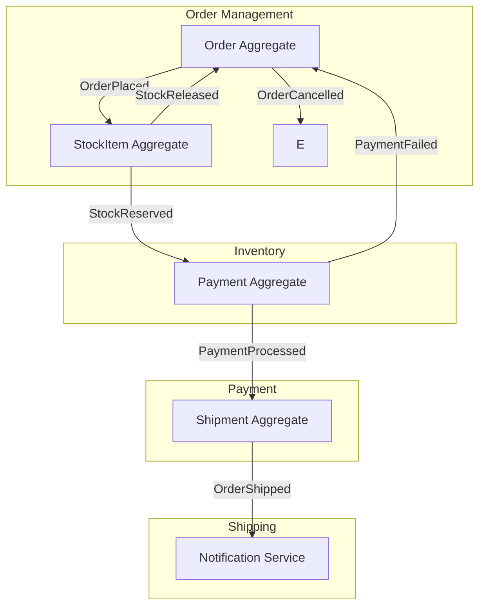

# Event Storming Command

Run an EventStorming workshop for: $ARGUMENTS

## Your Task

Guide a structured EventStorming session through three levels, producing actionable domain artifacts. Use the described domain or codebase as input.

## Step 1 — Preparation

Identify the domain scope from $ARGUMENTS or the current codebase:

```bash
# Explore domain language in codebase
grep -r "class\|interface\|type\|enum" src/ --include="*.ts" --include="*.java" | head -40
grep -rn "Event\|Command\|Handler\|Service\|Repository" src/ --include="*.ts" | head -30

# Look for existing domain model files
find src/ -name "*.ts" -path "*/domain/*" -o -name "*.ts" -path "*/entities/*" | head -20
```

## Step 2 — Big Picture (Domain Events)

**Goal:** Identify everything that happens in the domain.

Scan the codebase for existing events, then supplement with domain analysis:

```bash
grep -rn "Event\b" src/ --include="*.ts" --include="*.java" | grep -v "test\|spec\|mock" | head -30
grep -rn "emit\|publish\|dispatch" src/ --include="*.ts" | head -20
```

Produce the **Domain Event Timeline** (orange stickies):

```
Timeline →

[UserRegistered] → [EmailVerified] → [ProfileCompleted]
                                            │
[OrderPlaced] → [InventoryReserved] → [PaymentProcessed] → [OrderShipped]
                       │                      │
                [InventoryShortage]      [PaymentFailed]
                       ↓                      ↓
                [OrderCancelled] ←─────────────
```

**Rules:**
- Events are in past tense (UserRegistered, not UserRegister)
- Events represent meaningful business facts, not technical CRUD
- Include failure/exception events — they are often the most important
- Order events on a timeline left to right

## Step 3 — Process Level

**Goal:** Add Commands, Actors, and Policies.

For each cluster of events:

```
ACTOR          COMMAND              DOMAIN EVENT
(Yellow)       (Blue)               (Orange)
──────────     ────────────         ──────────────────
Customer   ──▶ Place Order      ──▶ OrderPlaced
System     ──▶ Reserve Inventory──▶ InventoryReserved
Payment    ──▶ Charge Customer  ──▶ PaymentProcessed
           ◀── (PaymentFailed)

POLICY (Purple): "When PaymentFailed → Cancel Order"
```

Identify:
- **Commands** (Blue): What triggers each event? (imperative: PlaceOrder, CancelOrder)
- **Actors** (Yellow): Who or what issues each command? (Customer, System, Scheduler)
- **Policies** (Purple): When event X happens → execute command Y
- **External Systems** (Pink): APIs, payment gateways, email services

Produce a Process Flow table:

| Actor | Command | Event | Policy triggered |
|-------|---------|-------|-----------------|
| Customer | PlaceOrder | OrderPlaced | → ReserveInventory |
| Inventory System | ReserveInventory | InventoryReserved | → ChargePayment |
| Payment Gateway | ChargePayment | PaymentProcessed | → CreateShipment |
| Payment Gateway | (failure) | PaymentFailed | → CancelOrder |
| Order System | CancelOrder | OrderCancelled | → ReleaseInventory |

## Step 4 — Design Level (Aggregates + Bounded Contexts)

**Goal:** Group events into aggregates and identify service boundaries.

**Aggregate identification rules:**
- An aggregate is the consistency boundary — commands change one aggregate atomically
- Events that share the same root entity → same aggregate
- If command must touch two aggregates → consider a saga or eventual consistency

```
Bounded Context: Order Management
├── Aggregate: Order
│   ├── Commands: PlaceOrder, CancelOrder, UpdateOrder
│   └── Events: OrderPlaced, OrderCancelled, OrderUpdated
│
Bounded Context: Inventory
├── Aggregate: StockItem
│   ├── Commands: ReserveStock, ReleaseStock, ReplenishStock
│   └── Events: StockReserved, StockReleased, StockReplenished
│
Bounded Context: Payment
├── Aggregate: Payment
│   ├── Commands: ChargeCustomer, RefundCustomer
│   └── Events: PaymentProcessed, PaymentFailed, RefundIssued
```

## Step 5 — Identify Hotspots

Mark areas of concern (Red stickies in real EventStorming):

- **Complexity hotspot**: Multiple aggregates must change together → saga needed?
- **Consistency hotspot**: Same data needed in multiple contexts → shared kernel or ACL?
- **Knowledge gap**: Team disagrees on who owns this event
- **Legacy system**: External system doesn't emit events → polling required

## Step 6 — Generate Artifacts

### Domain Event Glossar

```markdown
## Domain Event Glossar

| Event | Emitted By | Triggers | Payload |
|-------|-----------|---------|---------|
| OrderPlaced | OrderService | InventoryService.ReserveStock | orderId, customerId, items[], amount |
| InventoryReserved | InventoryService | PaymentService.Charge | orderId, items[], reservationId |
| PaymentProcessed | PaymentService | ShippingService.CreateShipment | orderId, paymentId, amount |
| PaymentFailed | PaymentService | OrderService.CancelOrder | orderId, reason |
| OrderCancelled | OrderService | InventoryService.ReleaseStock | orderId, cancelledBy |
| OrderShipped | ShippingService | NotificationService.NotifyCustomer | orderId, trackingNumber |
```

### Aggregate Map (Mermaid)



### Architecture Recommendations

Based on the model:

1. **Integration pattern**: [Events via Kafka / Choreography Saga / Orchestration Saga — choose based on consistency needs]
2. **Service boundaries**: [List identified bounded contexts as candidate microservices]
3. **Hotspots to address**: [List of complexity/consistency hotspots]
4. **Next step**: Model the highest-risk aggregate in detail before implementation

## Reference Skills

- `cqrs-event-sourcing` — CQRS, Event Sourcing, Outbox Pattern, Saga
- `event-driven-patterns` — Kafka, EventBridge, pub/sub, CloudEvents
- `multi-agent-patterns` — if agents model the domain actors
