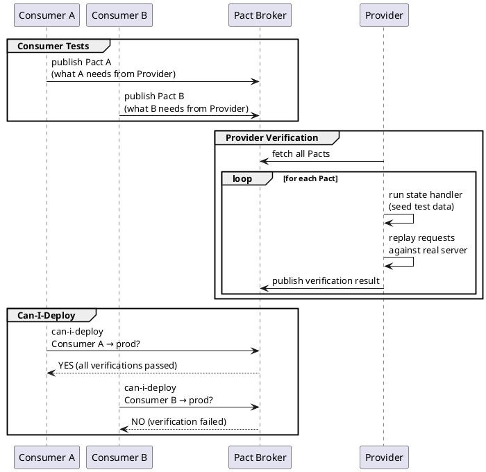

# API Contract — Advanced Patterns

For Kafka/NATS/SQS event interfaces and multi-consumer contract validation with Pact. For the core REST/OpenAPI workflow (steps 1-5), see `api-contract` first.

## When to Use

- Adding Kafka, NATS, SNS/SQS, or WebSocket interfaces (AsyncAPI)
- Multiple services consume the same API and need independent contract verification (Pact)
- Setting up `can-i-deploy` gates in CI

## Step 6: AsyncAPI for Event-Driven APIs

For Kafka, NATS, SNS/SQS, and WebSocket interfaces, use AsyncAPI 3.0 instead of OpenAPI.

```yaml
# api/v1/asyncapi.yaml
asyncapi: "3.0.0"
info:
  title: Order Events
  version: "1.0.0"

channels:
  order/created:
    address: "order.created"
    messages:
      OrderCreated:
        $ref: "#/components/messages/OrderCreated"

  order/cancelled:
    address: "order.cancelled"
    messages:
      OrderCancelled:
        $ref: "#/components/messages/OrderCancelled"

operations:
  publishOrderCreated:
    action: send
    channel:
      $ref: "#/channels/order~1created"

  receiveOrderCreated:
    action: receive
    channel:
      $ref: "#/channels/order~1created"

components:
  messages:
    OrderCreated:
      payload:
        type: object
        required: [orderId, customerId, occurredAt]
        properties:
          orderId:
            type: string
            format: uuid
          customerId:
            type: string
            format: uuid
          totalAmount:
            type: number
            format: decimal
          occurredAt:
            type: string
            format: date-time
```

Generate TypeScript types from AsyncAPI:
```bash
npx @asyncapi/generator \
  api/v1/asyncapi.yaml \
  @asyncapi/typescript-nats-template \
  -o src/generated/events
```

---

## Step 7: Consumer-Driven Contract Testing (Pact)

When multiple consumers use the same API, each consumer defines what **they** need — and the provider verifies it can satisfy all of them.



### Consumer Side (TypeScript)

```typescript
import { PactV3, MatchersV3 } from "@pact-foundation/pact"
const { like, eachLike } = MatchersV3

const provider = new PactV3({
  consumer: "OrderService",
  provider: "InventoryService",
})

describe("InventoryService contract", () => {
  it("returns stock for a product", async () => {
    await provider
      .given("product abc-123 has 10 units in stock")
      .uponReceiving("a request for product stock")
      .withRequest({ method: "GET", path: "/products/abc-123/stock" })
      .willRespondWith({
        status: 200,
        body: {
          productId: like("abc-123"),
          available: like(10),
        },
      })
      .executeTest(async (mockServer) => {
        const result = await getStock(mockServer.url, "abc-123")
        expect(result.available).toBe(10)
      })
  })
})
```

### Provider Verification (TypeScript / Jest)

```typescript
import { Verifier } from "@pact-foundation/pact"

describe("InventoryService provider verification", () => {
  it("satisfies all consumer pacts", () => {
    return new Verifier({
      providerBaseUrl: "http://localhost:3000",
      pactBrokerUrl: process.env.PACT_BROKER_URL,
      provider: "InventoryService",
      stateHandlers: {
        "product abc-123 has 10 units in stock": async () => {
          await db.seed({ productId: "abc-123", stock: 10 })
        },
      },
    }).verifyProvider()
  })
})
```

---

## Related Skills

- `api-contract` — Core REST/OpenAPI contract-first workflow (Steps 1-5)
- `contract-testing` — Consumer-Driven Contract Testing patterns and Pact setup
- `event-driven-patterns` — Kafka, NATS, and message queue architecture
