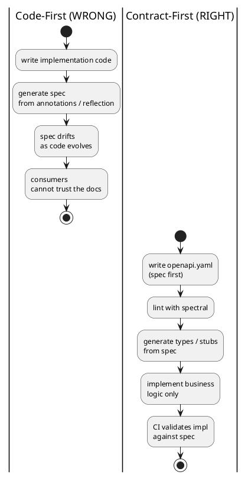
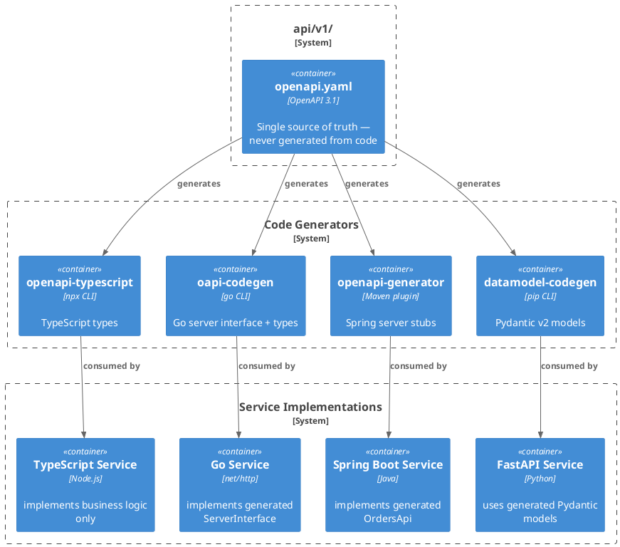

# Contract-First API Design

The spec is the source of truth. Code is generated from it — or validated against it. Never the other way around.

## When to Activate

- Starting any new API endpoint, service interface, or event schema
- Adding or changing a contract between two services
- Detecting whether a change is breaking for consumers
- Setting up API CI pipelines (lint, validate, diff)
- Integrating Consumer-Driven Contract Testing (Pact)
- Replacing a code-first API with a proper contract

---

## Core Principle



The spec defines the **public interface**. Implementation details are private.

---

## Step 1: Write the Spec First

### OpenAPI 3.1 Minimal Structure

```yaml
# api/v1/openapi.yaml
openapi: "3.1.0"
info:
  title: Orders API
  version: "1.0.0"

paths:
  /orders:
    post:
      operationId: createOrder
      summary: Create a new order
      requestBody:
        required: true
        content:
          application/json:
            schema:
              $ref: "#/components/schemas/CreateOrderRequest"
      responses:
        "201":
          description: Order created
          headers:
            Location:
              schema:
                type: string
              description: URL of the created order
          content:
            application/json:
              schema:
                $ref: "#/components/schemas/Order"
        "400":
          $ref: "#/components/responses/ValidationError"
        "422":
          $ref: "#/components/responses/UnprocessableEntity"

  /orders/{orderId}:
    get:
      operationId: getOrder
      parameters:
        - name: orderId
          in: path
          required: true
          schema:
            type: string
            format: uuid
      responses:
        "200":
          content:
            application/json:
              schema:
                $ref: "#/components/schemas/Order"
        "404":
          $ref: "#/components/responses/NotFound"

components:
  schemas:
    CreateOrderRequest:
      type: object
      required: [customerId, items]
      properties:
        customerId:
          type: string
          format: uuid
        items:
          type: array
          minItems: 1
          items:
            $ref: "#/components/schemas/OrderItem"

    OrderItem:
      type: object
      required: [productId, quantity]
      properties:
        productId:
          type: string
          format: uuid
        quantity:
          type: integer
          minimum: 1

    Order:
      type: object
      required: [id, customerId, status, items, createdAt]
      properties:
        id:
          type: string
          format: uuid
        customerId:
          type: string
          format: uuid
        status:
          type: string
          enum: [pending, confirmed, shipped, cancelled]
        items:
          type: array
          items:
            $ref: "#/components/schemas/OrderItem"
        createdAt:
          type: string
          format: date-time

  responses:
    ValidationError:
      description: Input validation failed
      content:
        application/problem+json:
          schema:
            $ref: "#/components/schemas/ProblemDetails"
    UnprocessableEntity:
      description: Semantically invalid request
      content:
        application/problem+json:
          schema:
            $ref: "#/components/schemas/ProblemDetails"
    NotFound:
      description: Resource not found
      content:
        application/problem+json:
          schema:
            $ref: "#/components/schemas/ProblemDetails"

    ProblemDetails:
      type: object
      required: [type, title, status]
      properties:
        type:
          type: string
          format: uri
        title:
          type: string
        status:
          type: integer
        detail:
          type: string
        instance:
          type: string
          format: uri
        errors:
          type: array
          items:
            type: object
            properties:
              field:
                type: string
              detail:
                type: string
```

### File Convention

```
api/
├── v1/
│   ├── openapi.yaml          # REST API contract
│   └── asyncapi.yaml         # Event/message contract (if applicable)
└── v2/
    └── openapi.yaml          # Breaking changes go in new version
```

The spec files live in version control alongside the code. They are the PR-reviewable contract.

---

## Step 2: Lint the Spec

Before generating or implementing anything, lint the spec with [Spectral](https://stoplight.io/open-source/spectral):

```bash
# Install
npm install -g @stoplight/spectral-cli

# Lint with built-in OpenAPI ruleset
spectral lint api/v1/openapi.yaml

# Lint with custom ruleset (enforce project conventions)
spectral lint api/v1/openapi.yaml --ruleset .spectral.yaml
```

### Custom Spectral Ruleset (`.spectral.yaml`)

```yaml
extends: ["spectral:oas"]
rules:
  # All operations must have operationId
  operation-operationId: error

  # All error responses must use application/problem+json
  error-response-content-type:
    message: Error responses must use application/problem+json
    given: "$.paths[*][*].responses[?(@property >= '400')].content"
    then:
      field: "application/problem+json"
      function: truthy

  # No inline schemas — use $ref
  no-inline-schemas:
    message: Use $ref instead of inline schemas
    given: "$.paths[*][*][responses,requestBody]..schema"
    then:
      field: "$ref"
      function: truthy
```

---

## Step 3: Generate Code from the Spec



### TypeScript / Node.js

```bash
# Generate typed client + server types
npx openapi-typescript api/v1/openapi.yaml -o src/generated/api.ts

# Or with @hey-api/openapi-ts (full SDK)
npx @hey-api/openapi-ts \
  --input api/v1/openapi.yaml \
  --output src/generated \
  --client fetch
```

Usage in TypeScript:
```typescript
// Use generated types — never write request/response types by hand
import type { paths } from "./generated/api"

type CreateOrderRequest = paths["/orders"]["post"]["requestBody"]["content"]["application/json"]
type Order = paths["/orders/{orderId}"]["get"]["responses"]["200"]["content"]["application/json"]
```

### Go

```bash
# Generate server interface + types with oapi-codegen
go install github.com/oapi-codegen/oapi-codegen/v2/cmd/oapi-codegen@latest

oapi-codegen \
  --config oapi-codegen.yaml \
  api/v1/openapi.yaml
```

`oapi-codegen.yaml`:
```yaml
package: api
generate:
  - types
  - server      # generates net/http or chi/echo handler interface
  - spec        # embeds spec for runtime validation
output: internal/api/generated.go
```

Implement only the interface — the routing and request parsing is generated:
```go
// Implement the generated ServerInterface — only business logic here
type OrderHandler struct{ svc *OrderService }

func (h *OrderHandler) CreateOrder(w http.ResponseWriter, r *http.Request) {
    // request already parsed and validated by generated middleware
}
```

### Java / Spring Boot

```bash
# Generate Spring server stubs
npx @openapitools/openapi-generator-cli generate \
  -i api/v1/openapi.yaml \
  -g spring \
  -o build/generated \
  --additional-properties=interfaceOnly=true,useSpringBoot3=true,useTags=true
```

`pom.xml` (Maven plugin — runs on build):
```xml
<plugin>
  <groupId>org.openapitools</groupId>
  <artifactId>openapi-generator-maven-plugin</artifactId>
  <version>7.x.x</version>
  <executions>
    <execution>
      <goals><goal>generate</goal></goals>
      <configuration>
        <inputSpec>${project.basedir}/api/v1/openapi.yaml</inputSpec>
        <generatorName>spring</generatorName>
        <configOptions>
          <interfaceOnly>true</interfaceOnly>
          <useSpringBoot3>true</useSpringBoot3>
        </configOptions>
      </configuration>
    </execution>
  </executions>
</plugin>
```

Implement only the interface:
```java
@RestController
public class OrderController implements OrdersApi {  // generated interface
    @Override
    public ResponseEntity<Order> createOrder(CreateOrderRequest req) {
        // business logic only — routing, validation, serialization: generated
    }
}
```

### Python / FastAPI

```bash
# Generate Pydantic models from spec
pip install datamodel-code-generator

datamodel-codegen \
  --input api/v1/openapi.yaml \
  --input-file-type openapi \
  --output src/generated/models.py \
  --output-model-type pydantic_v2.BaseModel
```

```python
from generated.models import CreateOrderRequest, Order

@router.post("/orders", response_model=Order, status_code=201)
async def create_order(request: CreateOrderRequest) -> Order:
    ...  # business logic only
```

---

## Step 4: Validate Implementation Against Spec

Running tests against the spec (not just unit tests):

### Schemathesis (property-based testing against spec)

```bash
pip install schemathesis

# Test a running server against its spec — finds contract violations automatically
schemathesis run api/v1/openapi.yaml \
  --base-url http://localhost:8080 \
  --checks all
```

Schemathesis generates test cases from the spec and verifies:
- All responses match declared schemas
- Status codes are correct
- Required fields are always present

### Dredd (example-based)

```bash
npm install -g dredd

dredd api/v1/openapi.yaml http://localhost:8080
```

---

## Step 5: Detect Breaking Changes in CI

A "breaking change" is any change that would break existing consumers without a version bump.

### Breaking vs. Non-Breaking

| Change | Breaking? |
|---|---|
| Remove a field from response | Yes |
| Rename a field | Yes |
| Change field type | Yes |
| Remove an endpoint | Yes |
| Add required request field | Yes |
| Add optional request field | No |
| Add new field to response | No |
| Add a new endpoint | No |
| Add a new enum value | Potentially (if consumer switches on enum) |

```plantuml
@startuml
start
fork
  :spectral lint\nopenapi.yaml;
  if (lint errors?) then (yes)
    :FAIL PR; <<#tomato>>
    detach
  endif
  :Lint OK;
fork again
  :oasdiff breaking\nmain vs PR branch;
  if (breaking changes\nwithout new version?) then (yes)
    :FAIL PR\n(bump to /v2/); <<#tomato>>
    detach
  endif
  :Breaking Change OK;
fork again
  :docker compose up;
  :schemathesis run\n--checks all;
  if (contract\nviolations?) then (yes)
    
    :FAIL PR; <<#tomato>>
    detach
  endif
  :Implementation OK;
end fork
:PR approved — merge allowed; <<#lightgreen>>
stop
@enduml
```

### oasdiff (CLI + CI)

```bash
# Install
go install github.com/tufin/oasdiff@latest

# Check for breaking changes between versions
oasdiff breaking api/v1/openapi-main.yaml api/v1/openapi-branch.yaml

# In CI (exit code 1 if breaking changes found)
oasdiff breaking \
  https://raw.githubusercontent.com/org/repo/main/api/v1/openapi.yaml \
  api/v1/openapi.yaml \
  --fail-on ERR
```

### GitHub Actions CI

```yaml
# .github/workflows/api-contract.yml
name: API Contract

on: [pull_request]

jobs:
  lint:
    runs-on: ubuntu-latest
    steps:
      - uses: actions/checkout@v4
      - name: Lint OpenAPI spec
        run: npx @stoplight/spectral-cli lint api/v1/openapi.yaml

  breaking-changes:
    runs-on: ubuntu-latest
    steps:
      - uses: actions/checkout@v4
        with:
          fetch-depth: 0
      - name: Detect breaking changes
        uses: tufin/oasdiff-action@main
        with:
          base: "origin/main:api/v1/openapi.yaml"
          revision: "api/v1/openapi.yaml"
          fail-on-diff: true

  validate-implementation:
    runs-on: ubuntu-latest
    steps:
      - uses: actions/checkout@v4
      - name: Start server
        run: docker compose up -d --wait
      - name: Run Schemathesis
        run: |
          pip install schemathesis
          schemathesis run api/v1/openapi.yaml \
            --base-url http://localhost:8080 \
            --checks all
```

---

## Steps 6-7: Event-Driven APIs and Contract Testing

For AsyncAPI 3.0 (Kafka, NATS, SQS, WebSocket) and Consumer-Driven Contract Testing with Pact, see `api-contract-advanced`.

---

## Contract-First Checklist

Before writing implementation code for any new API surface:

- [ ] Spec written in `api/v1/openapi.yaml` (or `asyncapi.yaml` for events)
- [ ] All schemas use `$ref` — no inline schemas
- [ ] All error responses reference `ProblemDetails` schema
- [ ] `operationId` set on every operation
- [ ] `spectral lint` passes with zero errors
- [ ] Code generated from spec (types, stubs, or interfaces)
- [ ] Implementation only touches business logic — not request/response shapes
- [ ] `schemathesis` or `dredd` runs in CI against live server
- [ ] `oasdiff` configured in CI to block breaking changes without version bump
- [ ] New version directory (`api/v2/`) created for any breaking change

---

## Anti-Patterns

### Generate Spec from Code
```
# BAD: spec becomes a reflection of implementation details
springdoc.api-docs.enabled=true   # auto-generates from annotations
```
The spec will drift the moment someone renames a method or adds an annotation. It becomes stale documentation, not a contract.

### Spec as Documentation Only
Writing the spec after the code, or keeping it in a Wiki/Notion — it will never be accurate or enforced.

### Skipping Validation in CI
If `schemathesis` or `oasdiff` does not run in CI, the contract is aspirational, not enforced.

### Shared Request/Response DTOs Between Services
Sharing Java/Go/TS types directly across services creates compile-time coupling. Share the spec file; generate independent types per service.

---

## Related Skills

- `api-design` — REST conventions (naming, status codes, pagination)
- `problem-details` — RFC 7807 error response implementation
- `strategic-ddd` — Published Language and Open Host Service patterns
- `hexagonal-typescript` / `hexagonal-java` — where generated types fit in the adapter layer
