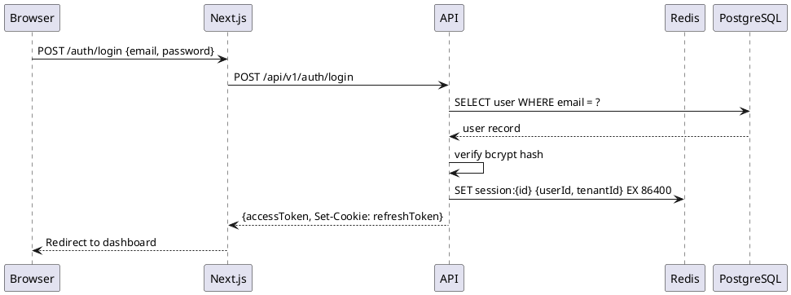
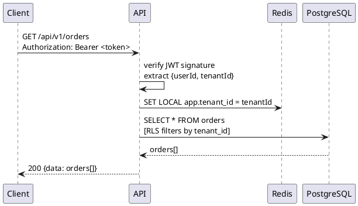

# arc42 + C4 Skill

arc42 is a template for architecture documentation with 12 sections. C4 is a diagram model (Context → Container → Component → Code) that maps directly into arc42's structural sections.

## When to Activate

- Generating or updating project architecture documentation
- Onboarding a new engineer to the system architecture
- After a major architectural decision (ADR) that changes the structure
- Before a large feature that touches multiple system layers
- When someone asks "how does this system actually work?"

---

## arc42 Sections — Quick Reference

| # | Section | C4 Diagram | Claude Skill |
|---|---------|-----------|--------------|
| 1 | Introduction & Goals | — | commands/prd.md (requirements) |
| 2 | Architecture Constraints | — | adr-writing (constraints documented) |
| 3 | System Scope & Context | C4 Level 1: Context | — |
| 4 | Solution Strategy | — | agents/solution-designer |
| 5 | Building Block View | C4 Level 2: Container + Level 3: Component | — |
| 6 | Runtime View | Sequence Diagrams | skills/api-contract |
| 7 | Deployment View | C4 Deployment Diagram | skills/kubernetes-patterns, deployment-patterns |
| 8 | Cross-cutting Concepts | — | observability, security-review, multi-tenancy, caching-patterns |
| 9 | Architecture Decisions | — | skills/adr-writing, commands/explore |
| 10 | Quality Requirements | — | skills/load-testing |
| 11 | Risks & Technical Debt | — | — |
| 12 | Glossary | — | — |

---

## Full arc42 Document Template

Save to: `docs/architecture/arc42.md`
Diagrams: `docs/architecture/diagrams/*.puml`

```markdown
# Architecture Documentation: <System Name>

> arc42 template + C4 diagrams
> Last updated: YYYY-MM-DD
> Status: Draft | Review | Accepted

---

## 1. Introduction and Goals

### 1.1 Requirements Overview

Brief summary of the system's core requirements (not a full list — link to PRD/specs):

- **Functional:** What the system does (3-5 bullets)
- **Non-functional:** Performance targets, availability SLO, compliance requirements

### 1.2 Quality Goals

Top 3-5 quality attributes that drive architectural decisions (pick from ISO 25010):

| Priority | Quality Goal | Scenario |
|----------|-------------|----------|
| 1 | Availability | System must be available 99.9% of the time |
| 2 | Security | No cross-tenant data leakage |
| 3 | Maintainability | New engineer productive in < 1 day |

### 1.3 Stakeholders

| Role | Expectations |
|------|-------------|
| End users | Fast, reliable, mobile-friendly |
| Operations team | Observable, deployable without downtime |
| Security/compliance | GDPR-compliant, auditable |

---

## 2. Architecture Constraints

Constraints that shape the architecture and cannot be changed:

### Technical Constraints
- Language/framework: <e.g., TypeScript + Node.js — existing team expertise>
- Cloud provider: <e.g., AWS — existing contracts>
- Database: <e.g., Postgres — data sovereignty requirement>

### Organizational Constraints
- Team size: <e.g., 3 engineers — no microservices overhead>
- Regulatory: <e.g., EU data residency required>
- Budget: <e.g., no managed vector DB — use pgvector>

---

## 3. System Scope and Context

### 3.1 Business Context

Who uses the system and what are the system's boundaries?


```plantuml
@startuml context
!include https://raw.githubusercontent.com/plantuml-stdlib/C4-PlantUML/master/C4_Context.puml

LAYOUT_WITH_LEGEND()
title System Context: <System Name>

Person(user, "End User", "Authenticated user of the application")
Person(admin, "Admin", "Internal operator managing the platform")

System(system, "<System Name>", "<1-sentence description of what the system does>")

System_Ext(stripe, "Stripe", "Payment processing")
System_Ext(sendgrid, "Resend / SendGrid", "Transactional email delivery")
System_Ext(auth, "Auth Provider", "Identity and SSO (Auth.js / Clerk)")
System_Ext(storage, "Object Storage", "File and asset storage (S3 / R2)")

Rel(user, system, "Uses", "HTTPS")
Rel(admin, system, "Manages", "HTTPS")
Rel(system, stripe, "Processes payments", "HTTPS API")
Rel(system, sendgrid, "Sends emails", "HTTPS API")
Rel(system, auth, "Delegates authentication", "HTTPS OIDC")
Rel(system, storage, "Stores files", "HTTPS API")
@enduml
```

### 3.2 Technical Context

External systems and their protocols:

| Neighbor System | Protocol | Direction | Data Exchanged |
|-----------------|----------|-----------|----------------|
| Stripe | HTTPS REST | Out | Payment intents, webhooks |
| Resend | HTTPS REST | Out | Email payloads |
| S3 / R2 | HTTPS S3 API | Out | Binary files |

---

## 4. Solution Strategy

Key decisions that shaped the architecture (brief — detail is in Section 9 ADRs):

| Decision | Choice | Rationale |
|----------|--------|-----------|
| Database | Postgres + pgvector | Existing expertise, RLS for multi-tenancy, vector search without extra infra |
| Auth | JWT + refresh token rotation | Stateless for API clients, httpOnly cookies for web |
| Deployment | Docker + Kubernetes | Team familiar, scales horizontally |
| API style | REST + OpenAPI | Strong tooling, code generation, familiar to clients |
| Frontend | Next.js App Router | SSR for SEO, React ecosystem, Vercel deployment |

---

## 5. Building Block View

### 5.1 Level 1: Container Diagram

Major deployable units and their responsibilities.


```plantuml
@startuml container
!include https://raw.githubusercontent.com/plantuml-stdlib/C4-PlantUML/master/C4_Container.puml

LAYOUT_WITH_LEGEND()
title Container Diagram: <System Name>

Person(user, "End User")

System_Boundary(system, "<System Name>") {
  Container(web, "Web Application", "Next.js 15", "Server-side rendered frontend. Serves UI, handles auth sessions.")
  Container(api, "API Server", "Node.js + Express", "REST API. Business logic, auth, data access.")
  Container(worker, "Background Worker", "BullMQ", "Processes async jobs: emails, webhooks, heavy computation.")
  ContainerDb(db, "Database", "PostgreSQL 18 + pgvector", "Primary data store. RLS for tenant isolation.")
  ContainerDb(cache, "Cache / Queue", "Redis 8", "Session store, job queue, rate limiting.")
  Container(storage, "File Storage", "S3 / Cloudflare R2", "User uploads and generated assets.")
}

System_Ext(stripe, "Stripe")
System_Ext(resend, "Resend")

Rel(user, web, "Uses", "HTTPS")
Rel(web, api, "Calls", "HTTPS REST")
Rel(api, db, "Reads/Writes", "SQL / TLS")
Rel(api, cache, "Reads/Writes", "Redis protocol")
Rel(api, worker, "Enqueues jobs", "BullMQ / Redis")
Rel(worker, db, "Reads/Writes", "SQL / TLS")
Rel(worker, resend, "Sends emails", "HTTPS")
Rel(api, stripe, "Creates payments", "HTTPS")
Rel(stripe, api, "Sends webhooks", "HTTPS")
@enduml
```

### 5.2 Level 2: Component Diagram — API Server

Internal components of the most complex container.


```plantuml
@startuml component-api
!include https://raw.githubusercontent.com/plantuml-stdlib/C4-PlantUML/master/C4_Component.puml

LAYOUT_WITH_LEGEND()
title Component Diagram: API Server

Container_Boundary(api, "API Server") {
  Component(router, "Router", "Express", "HTTP route definitions. Delegates to handlers.")
  Component(middleware, "Middleware", "Express middleware", "Auth (JWT), tenant context, rate limiting, logging.")
  Component(handlers, "Route Handlers", "TypeScript", "Request parsing, input validation (Zod), response serialization.")
  Component(services, "Services", "TypeScript", "Business logic. Orchestrates repositories and external calls.")
  Component(repos, "Repositories", "Drizzle ORM", "Data access layer. All DB queries go through here.")
  Component(jobs, "Job Dispatchers", "BullMQ", "Enqueue background jobs from service layer.")
}

ContainerDb(db, "PostgreSQL")
ContainerDb(cache, "Redis")

Rel(router, middleware, "Applies")
Rel(router, handlers, "Routes to")
Rel(handlers, services, "Calls")
Rel(services, repos, "Uses")
Rel(services, jobs, "Dispatches via")
Rel(repos, db, "Queries")
Rel(middleware, cache, "Session lookup")
@enduml
```

---

## 6. Runtime View

Key runtime scenarios — how the system behaves for the most important use cases.

### 6.1 User Login Flow



### 6.2 Authenticated API Request



---

## 7. Deployment View

How and where the system runs in production.


```plantuml
@startuml deployment
!include https://raw.githubusercontent.com/plantuml-stdlib/C4-PlantUML/master/C4_Deployment.puml

LAYOUT_WITH_LEGEND()
title Deployment Diagram: Production

Deployment_Node(cdn, "Vercel / CDN", "Edge Network") {
  Container(web, "Web Application", "Next.js")
}

Deployment_Node(k8s, "Kubernetes Cluster", "AWS EKS / GCP GKE") {
  Deployment_Node(ns_prod, "Namespace: production") {
    Container(api, "API Server", "Node.js, 3 replicas")
    Container(worker, "Worker", "BullMQ, 2 replicas")
  }
}

Deployment_Node(aws, "AWS / GCP", "Managed Services") {
  Deployment_Node(db_node, "RDS / Cloud SQL") {
    ContainerDb(db, "PostgreSQL 18", "Multi-AZ, automated backups")
  }
  Deployment_Node(cache_node, "ElastiCache / Memorystore") {
    ContainerDb(redis, "Redis 8", "Cluster mode")
  }
  Deployment_Node(storage_node, "S3 / R2") {
    Container(s3, "Object Storage", "Versioned, lifecycle policies")
  }
}

Rel(web, api, "HTTPS REST", "TLS 1.3")
Rel(api, db, "SQL", "TLS + IAM Auth")
Rel(api, redis, "Redis protocol", "TLS")
Rel(worker, db, "SQL", "TLS")
Rel(worker, redis, "Redis protocol", "TLS")
Rel(api, s3, "S3 API", "HTTPS")
@enduml
```

---

## 8. Cross-cutting Concepts

Patterns and principles applied consistently across the system.

### 8.1 Security
- All endpoints require JWT authentication (except `/health`, `/auth/*`)
- Multi-tenancy via Postgres RLS — `SET LOCAL app.tenant_id` before every query
- Secrets from environment variables / secret manager — never in source
- See: [security-review skill], [multi-tenancy skill]

### 8.2 Observability
- Structured JSON logging via pino (Node) — always include `{traceId, tenantId, userId}`
- Prometheus metrics: RED method (Rate, Errors, Duration) per route
- OpenTelemetry distributed tracing
- Health endpoints: `/health/live` (liveness) + `/health/ready` (readiness)
- See: [observability skill]

### 8.3 Error Handling
- All API errors return RFC 7807 Problem Details (`application/problem+json`)
- Errors logged with full context server-side; safe message returned to client
- See: [skills/problem-details]

### 8.4 Data Validation
- All inputs validated with Zod at API boundary
- Database constraints enforce invariants at storage level (NOT NULL, FK, CHECK)

### 8.5 Caching
- Cache-Aside pattern for entity reads (Redis, TTL-based)
- HTTP `Cache-Control` headers on all API responses
- See: [caching-patterns skill]

---

## 9. Architecture Decisions

All Architecture Decision Records live in `docs/decisions/`.

| ADR | Title | Status |
|-----|-------|--------|
| [ADR-001](../decisions/ADR-001-example.md) | Example decision | Accepted |

> New decisions: run `/explore <idea>` — the resulting ADR is automatically saved to `docs/decisions/` and should be linked here.

---

## 10. Quality Requirements

### 10.1 Quality Tree

| Quality | Sub-quality | Scenario | Measure |
|---------|-------------|----------|---------|
| Reliability | Availability | System under normal load | 99.9% monthly uptime |
| Performance | Latency | P99 API response | < 500ms |
| Performance | Throughput | Concurrent users | 1000 rps before degradation |
| Security | Isolation | Cross-tenant access attempt | Zero data leakage |
| Maintainability | Onboarding | New engineer | Productive in < 1 day |

### 10.2 Quality Scenarios (load testing targets)
- See: [load-testing skill] — k6 SLO thresholds match the table above

---

## 11. Risks and Technical Debt

| Risk | Probability | Impact | Mitigation |
|------|-------------|--------|-----------|
| Postgres single point of failure | Medium | High | Multi-AZ RDS, automated failover |
| pgvector at >5M vectors | Low | Medium | Monitor growth, plan Pinecone migration > 10M |
| Redis data loss on crash | Low | Low | Write-behind for critical data; Redis not primary store |
| JWT secret compromise | Low | Critical | Rotate immediately, invalidate all sessions via Redis |

**Known technical debt:**

| Item | Description | Priority |
|------|-------------|----------|
| — | — | — |

---

## 12. Glossary

| Term | Definition |
|------|-----------|
| Tenant | An organization or customer with isolated data |
| RLS | Row-Level Security — Postgres mechanism for tenant isolation |
| ADR | Architecture Decision Record — documents a significant architectural choice |
| Container (C4) | A deployable unit (app, service, DB) — not a Docker container specifically |
| BFF | Backend for Frontend — API layer tailored to a specific frontend's needs |

---

## Maintenance Rules

- **Update Section 3** when: system integrates a new external service
- **Update Section 5** when: a new container (service, DB, cache) is added or removed
- **Update Section 7** when: deployment infrastructure changes (new region, k8s upgrade)
- **Update Section 8** when: a new cross-cutting pattern is established (new logging standard, new auth flow)
- **Update Section 9** when: a new ADR is accepted — add it to the index table
- **Update Section 11** when: a new risk is identified or debt is resolved

## Anti-Patterns

- Writing Section 5 without a real diagram — prose alone is insufficient for building blocks
- Putting implementation details in Section 6 (runtime view) instead of sequence diagrams
- Keeping ADRs only in Section 9 without their own `docs/decisions/` file — always both
- Letting arc42 go stale — out-of-date architecture docs are worse than none (mislead new engineers)
