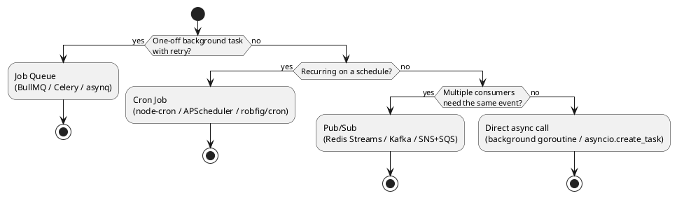

# Async Patterns Skill

Not everything should happen in the HTTP request cycle. Background jobs, event-driven processing, and scheduled tasks are essential for scalable, resilient systems.

## When to Activate

- A request triggers work that takes more than ~200ms (send email, generate PDF, call slow API)
- Processing that can fail and must retry (payment webhooks, third-party API calls)
- Scheduled recurring work (billing runs, cleanup jobs, report generation)
- Decoupling services via events (order placed → notify inventory, billing, notifications)
- Fan-out: one event triggers many downstream actions

---

## Choosing the Right Pattern



---

## Pattern 1: Job Queue

### TypeScript — BullMQ (Redis-backed)

```typescript
import { Queue, Worker, Job } from 'bullmq';

const connection = { host: process.env.REDIS_HOST, port: 6379 };

// Producer: add job from HTTP handler
const emailQueue = new Queue('email', { connection });

app.post('/api/v1/orders', async (req, res) => {
  const order = await Order.create(req.body);

  // Return immediately — don't wait for email
  await emailQueue.add('order-confirmation', {
    orderId: order.id,
    email: req.user.email,
  }, {
    attempts: 3,
    backoff: { type: 'exponential', delay: 1000 },  // 1s, 2s, 4s
    removeOnComplete: 100,  // keep last 100 completed
    removeOnFail: 500,      // keep last 500 failed for debugging
  });

  res.status(201).json({ data: order });
});

// Consumer: separate process (or worker thread)
const emailWorker = new Worker('email', async (job: Job) => {
  const { orderId, email } = job.data;
  await sendOrderConfirmationEmail(email, orderId);
}, { connection, concurrency: 10 });

emailWorker.on('failed', (job, err) => {
  logger.error({ job: job?.name, jobId: job?.id, err }, 'Job failed');
  Sentry.captureException(err, { extra: { jobData: job?.data } });
});
```

### Python — Celery

```python
from celery import Celery

app = Celery('tasks', broker=os.environ['REDIS_URL'], backend=os.environ['REDIS_URL'])
app.conf.task_acks_late = True  # Ack only after successful processing

@app.task(bind=True, max_retries=3, default_retry_delay=60)
def send_order_confirmation(self, order_id: str, email: str):
    try:
        send_email(email, order_id)
    except TemporaryError as exc:
        raise self.retry(exc=exc, countdown=2 ** self.request.retries)  # exponential

# Producer
@router.post('/orders')
async def create_order(data: OrderCreate, db: AsyncSession = Depends(get_db)):
    order = await Order.create(db, data)
    send_order_confirmation.delay(str(order.id), data.email)  # fire and forget
    return order
```

### Go — asynq

```go
import "github.com/hibiken/asynq"

// Producer
client := asynq.NewClient(asynq.RedisClientOpt{Addr: os.Getenv("REDIS_ADDR")})
task := asynq.NewTask("email:order-confirmation", payload, asynq.MaxRetry(3))
info, err := client.Enqueue(task, asynq.ProcessIn(0), asynq.Retention(48*time.Hour))

// Consumer
srv := asynq.NewServer(asynq.RedisClientOpt{Addr: addr}, asynq.Config{
    Concurrency: 10,
    Queues:      map[string]int{"critical": 6, "default": 3, "low": 1},
})
mux := asynq.NewServeMux()
mux.HandleFunc("email:order-confirmation", handleOrderConfirmation)
srv.Run(mux)
```

---

## Pattern 2: Dead Letter Queue (DLQ)

Jobs that fail all retries need human investigation, not silent discard.

```typescript
// BullMQ — failed jobs stay in queue, move to DLQ manually
const failedWorker = new Worker('email', async (job) => {
  // After maxAttempts, job goes to 'failed' set
}, { connection });

// Alert on failure
failedWorker.on('failed', async (job, err) => {
  if (job?.attemptsMade >= (job?.opts.attempts ?? 1)) {
    // Final failure — page on-call
    await alertQueue.add('dlq-alert', {
      queue: 'email',
      jobId: job?.id,
      error: err.message,
      data: job?.data,
    });
  }
});

// Admin endpoint to inspect and retry failed jobs
app.post('/admin/jobs/:id/retry', requireRole('admin'), async (req, res) => {
  const job = await Job.fromId(emailQueue, req.params.id);
  await job?.retry();
  res.json({ status: 'retrying' });
});
```

---

## Pattern 3: Idempotency

Jobs must be safe to run twice. Network failures cause duplicates.

```typescript
async function sendOrderConfirmation(job: Job) {
  const { orderId } = job.data;

  // Check if already processed (idempotency key)
  const key = `job:email:order-confirmation:${orderId}`;
  const alreadyDone = await redis.set(key, '1', { NX: true, EX: 86400 });
  if (!alreadyDone) {
    logger.info({ orderId }, 'Email already sent, skipping');
    return;  // Idempotent: safe to skip
  }

  await sendEmail(orderId);
}
```

**Rule:** Every job processor must be idempotent. Ask: "What happens if this runs twice?"

---

## Pattern 4: Scheduled Jobs (Cron)

```typescript
// TypeScript — node-cron
import cron from 'node-cron';

// Run at 2am every day
cron.schedule('0 2 * * *', async () => {
  const logger = rootLogger.child({ job: 'nightly-cleanup' });
  logger.info('Starting nightly cleanup');
  try {
    const deleted = await db.delete(expiredSessions).where(lt(expiredSessions.expiresAt, new Date()));
    logger.info({ deleted }, 'Nightly cleanup complete');
  } catch (err) {
    logger.error({ err }, 'Nightly cleanup failed');
    Sentry.captureException(err);
  }
}, { timezone: 'UTC' });
```

```python
# Python — APScheduler
from apscheduler.schedulers.asyncio import AsyncIOScheduler

scheduler = AsyncIOScheduler(timezone="UTC")

@scheduler.scheduled_job('cron', hour=2, minute=0)
async def nightly_cleanup():
    log.info("nightly_cleanup_started")
    count = await delete_expired_sessions()
    log.info("nightly_cleanup_done", deleted=count)

scheduler.start()
```

**Cron in distributed systems:** Only one instance should run a job. Use Redis `SET NX EX` as a distributed lock:

```typescript
async function runWithLock(jobName: string, ttlSeconds: number, fn: () => Promise<void>) {
  const lockKey = `cron-lock:${jobName}`;
  const acquired = await redis.set(lockKey, '1', { NX: true, EX: ttlSeconds });
  if (!acquired) return;  // Another instance is running it
  try {
    await fn();
  } finally {
    await redis.del(lockKey);
  }
}

cron.schedule('0 2 * * *', () => runWithLock('nightly-cleanup', 3600, doCleanup));
```

---

## Pattern 5: Event-Driven (Pub/Sub)

For fan-out — one event, multiple consumers.

```typescript
// Publisher
import { createClient } from 'redis';

const publisher = createClient({ url: process.env.REDIS_URL });

// Publish event after order created
await publisher.xAdd('events:orders', '*', {
  type: 'order.created',
  orderId: order.id,
  userId: order.userId,
  total: String(order.total),
  timestamp: new Date().toISOString(),
});

// Consumer group (each service is its own group — gets every message)
const subscriber = createClient({ url: process.env.REDIS_URL });
await subscriber.xGroupCreate('events:orders', 'notification-service', '0', { MKSTREAM: true });

// Process messages
while (true) {
  const messages = await subscriber.xReadGroup(
    'notification-service', 'worker-1',
    [{ key: 'events:orders', id: '>' }],
    { COUNT: 10, BLOCK: 5000 }
  );
  for (const { message } of messages?.[0]?.messages ?? []) {
    await handleOrderCreated(message);
    await subscriber.xAck('events:orders', 'notification-service', message.id);
  }
}
```

---

## Observability for Async Jobs

```typescript
// Log job start, success, failure with duration
const emailWorker = new Worker('email', async (job: Job) => {
  const start = Date.now();
  const jobLog = logger.child({ queue: 'email', jobId: job.id, jobName: job.name });
  jobLog.info({ data: job.data }, 'Job started');
  try {
    await processEmail(job.data);
    jobLog.info({ duration_ms: Date.now() - start }, 'Job completed');
    jobProcessedTotal.inc({ queue: 'email', status: 'success' });
  } catch (err) {
    jobLog.error({ err, duration_ms: Date.now() - start }, 'Job failed');
    jobProcessedTotal.inc({ queue: 'email', status: 'failure' });
    throw err;
  }
}, { connection });
```

---

## Checklist

- [ ] Long operations (> 200ms) moved out of HTTP handlers into jobs
- [ ] All job processors are idempotent (safe to run twice)
- [ ] Retry with exponential backoff configured
- [ ] Dead letter queue (or alert) for exhausted retries
- [ ] Cron jobs use distributed lock in multi-instance deployments
- [ ] Job failures tracked in Sentry / error tracker
- [ ] Jobs logged with duration and status
- [ ] Queue depth monitored (alert if queue grows unbounded)
