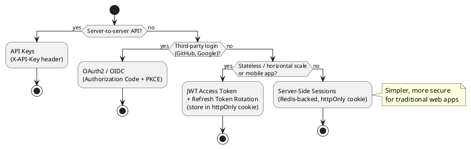

# Auth Patterns Skill

Authentication (who are you?) and authorization (what can you do?) are where most security vulnerabilities live. This skill covers correct implementation — not just review.

## When to Activate

- Implementing login / logout flows
- Choosing between JWT and server-side sessions
- Adding OAuth2 / social login (GitHub, Google, etc.)
- Implementing API key authentication (server-to-server)
- Adding role-based access control (RBAC)
- Implementing refresh token rotation
- Adding MFA (multi-factor authentication)

---

## Choosing the Right Auth Mechanism



---

## Pattern 1: Session-Based Auth (recommended for web apps)

Simpler, more secure than JWT for traditional web applications. The server holds state; tokens can be immediately invalidated.

### TypeScript (Express + Redis)

```typescript
import session from 'express-session';
import RedisStore from 'connect-redis';
import { createClient } from 'redis';
import bcrypt from 'bcrypt';

const redis = createClient({ url: process.env.REDIS_URL });
await redis.connect();

app.use(session({
  store: new RedisStore({ client: redis }),
  secret: process.env.SESSION_SECRET,  // min 32 random bytes
  name: '__Host-sid',  // __Host- prefix = Secure + no Domain = phishing protection
  resave: false,
  saveUninitialized: false,
  cookie: {
    httpOnly: true,       // JS cannot read it (XSS protection)
    secure: true,         // HTTPS only
    sameSite: 'lax',      // CSRF protection
    maxAge: 7 * 24 * 60 * 60 * 1000,  // 7 days
  },
}));

// Login
app.post('/api/v1/auth/login', async (req, res) => {
  const { email, password } = req.body;
  const user = await User.findByEmail(email);
  if (!user || !(await bcrypt.compare(password, user.passwordHash))) {
    // Same response for wrong email AND wrong password (timing-safe)
    return res.status(401).json(problem(401, 'Invalid credentials'));
  }
  req.session.regenerate((err) => {  // Prevent session fixation
    req.session.userId = user.id;
    req.session.role = user.role;
    res.status(200).json({ data: { id: user.id, email: user.email } });
  });
});

// Auth middleware
export function requireAuth(req, res, next) {
  if (!req.session.userId) {
    return res.status(401).json(problem(401, 'Authentication required'));
  }
  next();
}

// Logout
app.post('/api/v1/auth/logout', (req, res) => {
  req.session.destroy(() => {
    res.clearCookie('__Host-sid');
    res.status(204).send();
  });
});
```

---

## Pattern 2: JWT Auth (stateless / mobile)

Use when: mobile apps, microservices needing stateless auth, horizontal scaling without shared session store.

**Critical rules:**
- Store access token in memory (JS variable), NOT localStorage (XSS risk)
- Store refresh token in httpOnly cookie
- Short-lived access tokens (15 min), long-lived refresh tokens (7 days)
- Rotate refresh tokens on every use (detect theft)

```typescript
import jwt from 'jsonwebtoken';
import { randomBytes } from 'crypto';

const ACCESS_SECRET = process.env.JWT_ACCESS_SECRET;
const REFRESH_SECRET = process.env.JWT_REFRESH_SECRET;
const ACCESS_TTL = '15m';
const REFRESH_TTL = '7d';

function issueTokens(userId: string, role: string) {
  const accessToken = jwt.sign({ sub: userId, role }, ACCESS_SECRET, { expiresIn: ACCESS_TTL });
  const refreshToken = jwt.sign({ sub: userId, jti: randomBytes(16).toString('hex') }, REFRESH_SECRET, { expiresIn: REFRESH_TTL });
  return { accessToken, refreshToken };
}

// Login
app.post('/api/v1/auth/login', async (req, res) => {
  const user = await validateCredentials(req.body);
  const { accessToken, refreshToken } = issueTokens(user.id, user.role);

  // Refresh token: httpOnly cookie
  res.cookie('refresh_token', refreshToken, {
    httpOnly: true, secure: true, sameSite: 'strict',
    maxAge: 7 * 24 * 60 * 60 * 1000,
    path: '/api/v1/auth/refresh',  // Only sent to refresh endpoint
  });

  // Access token: response body (client stores in memory)
  res.json({ data: { access_token: accessToken, expires_in: 900 } });
});

// Refresh — rotate refresh token on every use
app.post('/api/v1/auth/refresh', async (req, res) => {
  const token = req.cookies.refresh_token;
  if (!token) return res.status(401).json(problem(401, 'No refresh token'));

  try {
    const payload = jwt.verify(token, REFRESH_SECRET) as jwt.JwtPayload;

    // Check token hasn't been used before (rotation theft detection)
    const used = await redis.get(`refresh:used:${payload.jti}`);
    if (used) {
      // Token reuse detected — invalidate all refresh tokens for user
      await redis.set(`refresh:revoked:${payload.sub}`, '1', { EX: 7 * 24 * 3600 });
      return res.status(401).json(problem(401, 'Refresh token reuse detected'));
    }

    await redis.set(`refresh:used:${payload.jti}`, '1', { EX: 7 * 24 * 3600 });
    const user = await User.findById(payload.sub);
    const { accessToken, refreshToken: newRefresh } = issueTokens(user.id, user.role);

    res.cookie('refresh_token', newRefresh, { httpOnly: true, secure: true, sameSite: 'strict',
      maxAge: 7 * 24 * 60 * 60 * 1000, path: '/api/v1/auth/refresh' });
    res.json({ data: { access_token: accessToken, expires_in: 900 } });
  } catch {
    res.status(401).json(problem(401, 'Invalid refresh token'));
  }
});

// Auth middleware
export function requireAuth(req, res, next) {
  const token = req.headers.authorization?.replace('Bearer ', '');
  if (!token) return res.status(401).json(problem(401, 'Missing token'));
  try {
    req.user = jwt.verify(token, ACCESS_SECRET) as jwt.JwtPayload;
    next();
  } catch {
    res.status(401).json(problem(401, 'Invalid token'));
  }
}
```

---

## Pattern 3: OAuth2 / OIDC (Social Login)

```typescript
// GitHub OAuth2 — Authorization Code flow with state param (CSRF protection)
import { randomBytes } from 'crypto';

app.get('/api/v1/auth/github', (req, res) => {
  const state = randomBytes(16).toString('hex');
  req.session.oauthState = state;  // Store state in session

  const params = new URLSearchParams({
    client_id: process.env.GITHUB_CLIENT_ID,
    redirect_uri: `${process.env.APP_URL}/api/v1/auth/github/callback`,
    scope: 'read:user user:email',
    state,
  });
  res.redirect(`https://github.com/login/oauth/authorize?${params}`);
});

app.get('/api/v1/auth/github/callback', async (req, res) => {
  const { code, state } = req.query;

  // Validate state (CSRF protection)
  if (state !== req.session.oauthState) {
    return res.status(400).json(problem(400, 'Invalid OAuth state'));
  }
  delete req.session.oauthState;

  // Exchange code for token
  const tokenRes = await fetch('https://github.com/login/oauth/access_token', {
    method: 'POST',
    headers: { 'Accept': 'application/json', 'Content-Type': 'application/json' },
    body: JSON.stringify({
      client_id: process.env.GITHUB_CLIENT_ID,
      client_secret: process.env.GITHUB_CLIENT_SECRET,
      code,
    }),
  });
  const { access_token } = await tokenRes.json();

  // Fetch user profile
  const profileRes = await fetch('https://api.github.com/user', {
    headers: { Authorization: `Bearer ${access_token}`, 'User-Agent': 'MyApp' },
  });
  const profile = await profileRes.json();

  // Find or create user — match by GitHub ID, not email (emails can change)
  let user = await User.findByGithubId(profile.id);
  if (!user) {
    user = await User.create({
      githubId: profile.id,
      name: profile.name ?? profile.login,
      avatarUrl: profile.avatar_url,
    });
  }

  req.session.regenerate(() => {
    req.session.userId = user.id;
    res.redirect(process.env.APP_URL + '/dashboard');
  });
});
```

---

## Pattern 4: API Keys (Server-to-Server)

```typescript
import { createHash, timingSafeEqual } from 'crypto';

// Generate: store prefix (for display) + hash (for verification)
async function createApiKey(userId: string) {
  const key = `sk_live_${randomBytes(32).toString('base64url')}`;
  const keyHash = createHash('sha256').update(key).digest('hex');
  const prefix = key.substring(0, 12);  // e.g. "sk_live_Abc1"

  await db.insert(apiKeys).values({ userId, keyHash, prefix });
  return key;  // Return the raw key ONCE — never store it
}

// Middleware: constant-time comparison (prevents timing attacks)
export async function apiKeyAuth(req, res, next) {
  const key = req.headers['x-api-key'];
  if (!key) return res.status(401).json(problem(401, 'Missing API key'));

  const keyHash = createHash('sha256').update(key).digest('hex');
  const apiKey = await db.query.apiKeys.findFirst({
    where: eq(apiKeys.keyHash, keyHash),
  });

  if (!apiKey) {
    // Still do the comparison to prevent timing attacks
    timingSafeEqual(Buffer.from(keyHash), Buffer.from(keyHash));
    return res.status(401).json(problem(401, 'Invalid API key'));
  }

  await db.update(apiKeys).set({ lastUsedAt: new Date() }).where(eq(apiKeys.id, apiKey.id));
  req.userId = apiKey.userId;
  next();
}
```

---

## Pattern 5: RBAC (Role-Based Access Control)

```typescript
// Define roles and permissions
const permissions = {
  admin: ['users:read', 'users:write', 'orders:read', 'orders:write', 'orders:delete'],
  manager: ['orders:read', 'orders:write'],
  customer: ['orders:read'],
} as const;

type Permission = typeof permissions[keyof typeof permissions][number];

// Middleware factory
export function requirePermission(permission: Permission) {
  return (req, res, next) => {
    const userRole = req.session?.role ?? req.user?.role;
    const allowed = permissions[userRole] ?? [];
    if (!allowed.includes(permission)) {
      return res.status(403).json(problem(403, 'Insufficient permissions'));
    }
    next();
  };
}

// Usage
app.delete('/api/v1/orders/:id',
  requireAuth,
  requirePermission('orders:delete'),
  deleteOrderHandler,
);
```

---

## Security Hardening Checklist

- [ ] Passwords hashed with bcrypt (cost factor ≥ 12) or argon2id — never SHA/MD5
- [ ] Session secret is 32+ random bytes from `crypto.randomBytes()`
- [ ] `session.regenerate()` called on login (prevent session fixation)
- [ ] Refresh tokens rotated on every use, old tokens invalidated
- [ ] OAuth2 state parameter validated (CSRF protection)
- [ ] OAuth2 users matched by provider ID, not email
- [ ] API keys hashed with SHA-256 before storage — raw key never stored
- [ ] API key comparison uses `timingSafeEqual` (prevent timing attacks)
- [ ] Auth cookies: `httpOnly`, `secure`, `sameSite` all set
- [ ] RBAC checked server-side on every request, never client-side only
- [ ] Rate limiting on login (5 attempts/15min per IP)
- [ ] Account lockout or CAPTCHA after brute force threshold
- [ ] Error messages identical for wrong email AND wrong password
- [ ] No sensitive data (tokens, passwords) in logs or error responses
