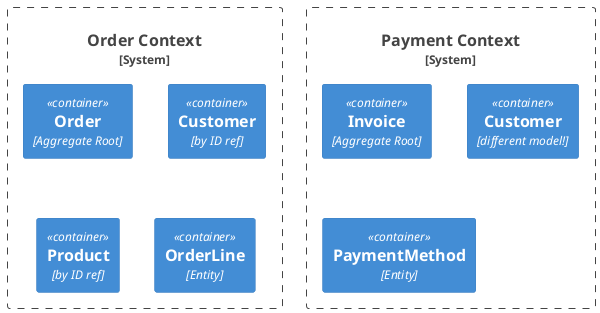

# Domain-Driven Design for Java

Tactical DDD patterns for rich, behavior-driven domain models.

## When to Activate

- Modeling a new domain concept (what is this thing? entity or value object?)
- Deciding whether logic belongs in domain, use case, or adapter
- Identifying aggregate boundaries and consistency rules
- Designing domain events and their dispatch
- Reviewing for anemic domain model (data containers with no behavior)
- Naming classes, methods, and packages (ubiquitous language)
- Planning a multi-service system with bounded contexts

---

## Building Block 1: Value Objects

**Identity**: none — equal when all fields are equal.
**Rule**: Immutable. No setters. Use records or final classes.

```java
// domain/model/Money.java
public record Money(BigDecimal amount, Currency currency) {

    public Money {
        Objects.requireNonNull(amount, "amount required");
        Objects.requireNonNull(currency, "currency required");
        if (amount.compareTo(BigDecimal.ZERO) < 0)
            throw new InvalidMoneyException("amount must be non-negative");
    }

    public Money add(Money other) {
        if (!this.currency.equals(other.currency))
            throw new CurrencyMismatchException(this.currency, other.currency);
        return new Money(this.amount.add(other.amount), this.currency);
    }

    public boolean isZero() {
        return amount.compareTo(BigDecimal.ZERO) == 0;
    }
}

// domain/model/MarketId.java  — typed ID prevents primitive obsession
public record MarketId(Long value) {
    public MarketId { Objects.requireNonNull(value, "id required"); }
}
```

**Common Value Objects**: `Money`, `Email`, `PhoneNumber`, `Address`, `DateRange`, typed IDs (`MarketId`, `UserId`), `Percentage`, `Quantity`.

---

## Building Block 2: Entities

**Identity**: defined by a unique ID — two entities with the same ID are the same object, regardless of field values.
**Rule**: Has behavior (domain methods), not just data. Keep mutable state minimal and guarded.

```java
// domain/model/Market.java
public class Market {
    private final MarketId id;
    private String name;
    private MarketStatus status;
    private final List<DomainEvent> domainEvents = new ArrayList<>();

    private Market(MarketId id, String name, MarketStatus status) {
        this.id = id;
        this.name = name;
        this.status = status;
    }

    // Factory method — enforces invariants on creation
    public static Market create(String name) {
        if (name == null || name.isBlank()) throw new InvalidMarketException("name required");
        return new Market(null, name, MarketStatus.DRAFT);
    }

    // Behavior — not a setter
    public void publish() {
        if (this.status != MarketStatus.DRAFT)
            throw new MarketAlreadyPublishedException(id);
        this.status = MarketStatus.ACTIVE;
        domainEvents.add(new MarketPublishedEvent(id, name));
    }

    // Equality by identity
    @Override
    public boolean equals(Object o) {
        if (this == o) return true;
        if (!(o instanceof Market m)) return false;
        return id != null && id.equals(m.id);
    }

    @Override public int hashCode() { return Objects.hashCode(id); }

    public MarketId id() { return id; }
    public String name() { return name; }
    public MarketStatus status() { return status; }
    public List<DomainEvent> pullDomainEvents() {
        var events = List.copyOf(domainEvents);
        domainEvents.clear();
        return events;
    }
}
```

---

## Building Block 3: Aggregates & Aggregate Root

An **Aggregate** is a cluster of domain objects (entities + value objects) treated as a unit for data changes.
The **Aggregate Root** is the only entry point — external code never holds references to internal entities directly.

### Rules
- **One transaction = one aggregate** — never modify two aggregates in one transaction
- **Reference other aggregates by ID only** — never by object reference
- **Repository per Aggregate Root** — no repository for child entities
- **Invariants are enforced inside the aggregate** — the root ensures the cluster is always consistent

```java
// domain/model/Order.java — Aggregate Root
public class Order {
    private final OrderId id;
    private final CustomerId customerId;      // reference by ID, not Customer object
    private final List<OrderLine> lines;      // internal entity — not accessible directly
    private OrderStatus status;

    private Order(OrderId id, CustomerId customerId) {
        this.id = id;
        this.customerId = customerId;
        this.lines = new ArrayList<>();
        this.status = OrderStatus.DRAFT;
    }

    public static Order create(CustomerId customerId) {
        return new Order(null, Objects.requireNonNull(customerId));
    }

    // Aggregate method — enforces internal invariant
    public void addLine(ProductId productId, Quantity quantity, Money unitPrice) {
        if (status != OrderStatus.DRAFT)
            throw new OrderAlreadyPlacedException(id);
        lines.add(new OrderLine(productId, quantity, unitPrice));
    }

    public Money totalPrice() {
        return lines.stream()
            .map(OrderLine::subtotal)
            .reduce(Money.zero(Currency.EUR), Money::add);
    }

    public void place() {
        if (lines.isEmpty()) throw new EmptyOrderException(id);
        this.status = OrderStatus.PLACED;
    }

    // Only expose read-only view of lines — protect internal collection
    public List<OrderLine> lines() { return Collections.unmodifiableList(lines); }
}

// domain/model/OrderLine.java — internal entity (no public repository)
public class OrderLine {
    private final ProductId productId;
    private final Quantity quantity;
    private final Money unitPrice;

    OrderLine(ProductId productId, Quantity quantity, Money unitPrice) {
        this.productId = productId;
        this.quantity = quantity;
        this.unitPrice = unitPrice;
    }

    public Money subtotal() {
        return unitPrice.multiply(quantity.value());
    }
}
```

---

## Building Block 4: Domain Services

**When**: Logic belongs in the domain but doesn't naturally fit a single entity or value object.
**Rule**: Stateless. No Spring annotations (`@Service` belongs in adapters). Named after domain verbs.

```java
// domain/service/PricingPolicy.java — domain service
public class PricingPolicy {

    public Money calculateFinalPrice(Order order, DiscountCode discountCode) {
        Money base = order.totalPrice();
        if (discountCode.isValid() && discountCode.appliesTo(order)) {
            return base.subtract(discountCode.discountAmount(base));
        }
        return base;
    }
}

// Wired in config — domain service is a plain Java object
@Bean
PricingPolicy pricingPolicy() { return new PricingPolicy(); }
```

**Domain Service vs Application Service**:

| | Domain Service | Application Service (Use Case) |
|---|---|---|
| Location | `domain/service/` | `application/usecase/` |
| Depends on | Domain model only | Ports (in + out), domain service |
| Has `@Transactional` | Never | Yes |
| Has Spring annotations | Never | Can (via config) |
| Example | `PricingPolicy`, `TransferPolicy` | `CreateOrderUseCase`, `PlaceOrderService` |

---

## Building Block 5: Domain Events

Domain events represent something that **happened** in the domain. They are immutable facts.

```java
// domain/event/DomainEvent.java — base interface
public interface DomainEvent {
    Instant occurredAt();
}

// domain/event/MarketPublishedEvent.java
public record MarketPublishedEvent(
    MarketId marketId,
    String name,
    Instant occurredAt
) implements DomainEvent {
    public MarketPublishedEvent(MarketId marketId, String name) {
        this(marketId, name, Instant.now());
    }
}
```

### Dispatching Domain Events (Spring Events pattern)

```java
// application/usecase/PublishMarketService.java
@Transactional
public class PublishMarketService implements PublishMarketUseCase {

    private final MarketRepository marketRepository;
    private final ApplicationEventPublisher eventPublisher;

    @Override
    public void publish(MarketId marketId) {
        var market = marketRepository.findById(marketId)
            .orElseThrow(() -> new MarketNotFoundException(marketId));

        market.publish();                           // raises event inside aggregate
        marketRepository.save(market);

        // Dispatch after successful save — events are pulled from aggregate
        market.pullDomainEvents().forEach(eventPublisher::publishEvent);
    }
}

// Listener lives in adapter — not in domain
// adapter/in/messaging/MarketEventListener.java
@Component
class MarketEventListener {

    @EventListener
    void on(MarketPublishedEvent event) {
        // send notification, update search index, etc.
    }
}
```

---

## Ubiquitous Language

Use the **same terms** in code as domain experts use in conversation. Never translate between domain language and technical language.

```java
// ❌ Technical naming — no domain meaning
public class MarketProcessor {
    public MarketData processMarketData(MarketDataInput input) {}
}

// ✅ Ubiquitous language — mirrors domain expert speech
public class Market {
    public void publish() {}
    public void suspend(SuspensionReason reason) {}
    public void resolve(ResolutionOutcome outcome) {}
}
```

**Enforce in code reviews**: If a domain expert wouldn't recognize a term, rename it.

---

## Bounded Contexts

A Bounded Context is an explicit boundary within which a domain model is defined and applicable.
Each microservice should typically correspond to **one Bounded Context**.



### Context Mapping (anti-corruption layer between contexts)

When Context A calls Context B, translate at the boundary — don't leak B's model into A:

```java
// adapter/out/client/PaymentContextAdapter.java — anti-corruption layer
@Component
class PaymentContextAdapter implements PaymentPort {

    private final PaymentApiClient paymentApiClient;

    @Override
    public PaymentResult initiatePayment(Order order, Money amount) {
        // Translate: Order domain model → Payment API request DTO
        var request = new PaymentApiRequest(
            order.id().value().toString(),
            amount.amount(),
            amount.currency().getCurrencyCode()
        );
        var response = paymentApiClient.charge(request);
        // Translate: Payment API response → domain PaymentResult
        return new PaymentResult(response.isSuccess(), response.transactionId());
    }
}
```

---

## Anti-Patterns to Avoid

### Anemic Domain Model
```java
// ❌ Pure data container — no behavior, all logic in use case
public class Market {
    private String status;
    public String getStatus() { return status; }
    public void setStatus(String status) { this.status = status; }  // behavior-free!
}

// ❌ Use case doing domain work it shouldn't
public class PublishMarketService {
    public void publish(Long id) {
        var market = repo.findById(id);
        if (!market.getStatus().equals("DRAFT"))  // domain rule leaked out!
            throw new IllegalStateException();
        market.setStatus("ACTIVE");               // direct mutation, no intent
        repo.save(market);
    }
}

// ✅ Rich domain model
public class Market {
    public void publish() {                       // intent is clear
        if (status != DRAFT) throw new MarketAlreadyPublishedException(id);
        this.status = ACTIVE;
    }
}
```

### Primitive Obsession
```java
// ❌ String everywhere — no type safety, can confuse userId with marketId
void createOrder(String userId, String marketId, BigDecimal amount) {}

// ✅ Typed IDs and value objects
void createOrder(UserId userId, MarketId marketId, Money amount) {}
```

### Repository per Entity (not per Aggregate Root)
```java
// ❌ Direct access to internal entities
orderLineRepository.save(orderLine);    // bypasses Order aggregate invariants!

// ✅ Only via aggregate root
order.addLine(productId, quantity, price);
orderRepository.save(order);            // cascade through aggregate
```

---

## DDD Checklist for New Projects

- [ ] Identify Bounded Contexts (one per service / module)
- [ ] Define Ubiquitous Language (glossary per context)
- [ ] Model Aggregate Roots (what enforces consistency?)
- [ ] Identify Value Objects (immutable, by-value equality)
- [ ] Define Domain Events (what facts must be communicated?)
- [ ] Locate Domain Services (stateless logic not fitting an entity)
- [ ] Ensure Repository per Aggregate Root (not per entity)
- [ ] Avoid Anemic Domain Model (entities have behavior)
- [ ] Protect aggregate internals (no public access to child entities)
- [ ] Reference other aggregates by ID only

## DDD Checklist for Existing Projects (Refactoring)

- [ ] Find "setters on everything" classes → extract domain methods with intent
- [ ] Find use cases containing `if (status == X)` → move to aggregate
- [ ] Find cross-aggregate transactions → split or use eventual consistency
- [ ] Find repositories for non-root entities → remove, route through root
- [ ] Find `String slug` / `Long id` as method params → introduce typed IDs
- [ ] Find primitive validation scattered in use cases → move to value objects

## Reference

- **Strategic DDD** (Bounded Contexts, Context Map, Subdomain classification, Event Storming): see skill `strategic-ddd`
- **Hexagonal Architecture** (package structure, adapters): see skill `hexagonal-java`
- **Spring Boot wiring**: see skill `springboot-patterns`
- **JPA persistence adapter patterns**: see skill `jpa-patterns`
