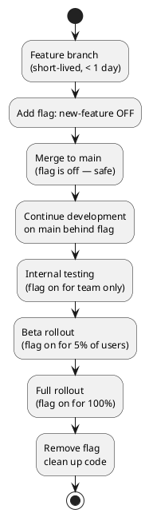

# Feature Flags Skill

Deploy code without releasing features. Feature flags decouple deployment from release, enabling dark launches, gradual rollouts, A/B tests, and instant kill switches.

## When to Activate

- Rolling out a feature to a subset of users first
- Enabling trunk-based development (no long-lived feature branches)
- Implementing A/B testing or experiments
- Needing an instant kill switch for a risky feature
- Testing a feature in production before public launch
- Managing feature access by plan tier or user segment

---

## Flag Types

| Type | Use Case | Example |
|------|----------|---------|
| Boolean | On/Off for everyone | `new-checkout-flow: true` |
| Percentage | Gradual rollout | 10% → 50% → 100% of users |
| User-targeted | Beta users, internal team | `user.id IN [123, 456]` |
| Attribute-based | By plan, country, etc. | `user.plan == 'pro'` |

---

## Option A: Managed Service (LaunchDarkly / Unleash)

**Pros:** Real-time updates, rich targeting, analytics, no infrastructure
**Cons:** Cost, vendor dependency

### LaunchDarkly (TypeScript)

```typescript
import { init } from '@launchdarkly/node-server-sdk';

const ldClient = init(process.env.LAUNCHDARKLY_SDK_KEY);
await ldClient.waitForInitialization({ timeout: 10 });

// Evaluate a flag
const showNewCheckout = await ldClient.variation(
  'new-checkout-flow',
  { key: user.id, email: user.email, custom: { plan: user.plan } },
  false,  // default value if flag not found
);

if (showNewCheckout) {
  return newCheckoutFlow();
}
return legacyCheckoutFlow();
```

### Unleash (self-hosted, TypeScript)

```typescript
import { initialize } from 'unleash-client';

const unleash = initialize({
  url: process.env.UNLEASH_URL,
  appName: 'order-service',
  customHeaders: { Authorization: process.env.UNLEASH_TOKEN },
});

await new Promise(resolve => unleash.on('synchronized', resolve));

if (unleash.isEnabled('new-checkout-flow', { userId: user.id })) {
  return newCheckoutFlow();
}
```

---

## Option B: Homegrown Redis-Based (simple, no external service)

Best for small teams, internal flags, or when vendor cost is prohibitive.

```typescript
// src/lib/flags.ts
import { createClient } from 'redis';

const redis = createClient({ url: process.env.REDIS_URL });

export interface FlagConfig {
  enabled: boolean;
  percentage?: number;  // 0-100, if set: enabled for X% of users
  allowList?: string[]; // specific user IDs always enabled
  denyList?: string[];  // specific user IDs always disabled
}

export async function isEnabled(flagName: string, userId?: string): Promise<boolean> {
  const raw = await redis.get(`flag:${flagName}`);
  if (!raw) return false;

  const config: FlagConfig = JSON.parse(raw);
  if (!config.enabled) return false;

  if (userId) {
    if (config.denyList?.includes(userId)) return false;
    if (config.allowList?.includes(userId)) return true;

    if (config.percentage !== undefined) {
      // Deterministic: same user always gets same result
      const hash = hashUserId(userId + flagName);
      return (hash % 100) < config.percentage;
    }
  }

  return config.enabled;
}

function hashUserId(input: string): number {
  let hash = 5381;
  for (let i = 0; i < input.length; i++) {
    hash = ((hash << 5) + hash) + input.charCodeAt(i);
  }
  return Math.abs(hash);
}

// Management API (admin only)
export async function setFlag(name: string, config: FlagConfig) {
  await redis.set(`flag:${name}`, JSON.stringify(config));
}

// Usage
const enabled = await isEnabled('new-checkout-flow', req.user.id);
```

---

## Trunk-Based Development with Flags

Feature flags enable everyone to merge to main continuously, even for incomplete features:



**Rule:** Every new feature that takes > 1 day gets a flag. No feature branches longer than a day.

---

## Flag Lifecycle

Flags MUST be cleaned up. Stale flags are technical debt.

```typescript
// WRONG: permanent flag code
if (await isEnabled('new-checkout', userId)) {
  // This if-block stays in codebase for years ← tech debt
}

// RIGHT: flag lifecycle
// Phase 1: Add flag (flag=false)
// Phase 2: Roll out (flag=10% → 100%)
// Phase 3: Stabilize (2 weeks at 100%, confirm no issues)
// Phase 4: Remove flag — delete the condition, keep only the new code
// Phase 5: Delete the flag from Redis/LaunchDarkly
```

Track flag age. Create a ticket when adding each flag for cleanup in 4-8 weeks.

---

## Flag Naming Convention

```
<area>-<feature>-<variant?>

Examples:
  checkout-new-flow
  auth-passkeys
  payments-stripe-v2
  dashboard-dark-mode
  api-cursor-pagination
```

---

## Testing with Feature Flags

```typescript
// Unit tests: inject flag resolver
async function processOrder(order: Order, flags: FlagResolver) {
  if (await flags.isEnabled('new-checkout', order.userId)) {
    return newCheckout(order);
  }
  return legacyCheckout(order);
}

// Test both paths explicitly
it('uses new checkout when flag enabled', async () => {
  const flags = { isEnabled: async () => true };
  await expect(processOrder(order, flags)).resolves.toEqual(newResult);
});

it('uses legacy checkout when flag disabled', async () => {
  const flags = { isEnabled: async () => false };
  await expect(processOrder(order, flags)).resolves.toEqual(legacyResult);
});
```

---

## Checklist

- [ ] Every flag has a ticket for cleanup (set deadline when creating)
- [ ] Flags stored externally (Redis/LaunchDarkly) — not in code or env vars
- [ ] Percentage rollouts are deterministic (same user = same result)
- [ ] Flag evaluation has a default (what happens if Redis is down?)
- [ ] Both flag paths have tests (enabled AND disabled)
- [ ] Flag names follow convention (`<area>-<feature>`)
- [ ] Old flags removed within 4-8 weeks of full rollout
