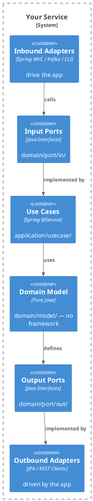

# Hexagonal Architecture for Java / Spring Boot

Ports & Adapters architecture for testable, framework-independent Java services.

## When to Activate

- Structuring a new Java/Spring Boot service from scratch
- Reviewing whether domain logic has leaked into adapters (or vice versa)
- Deciding where a new class belongs in the package hierarchy
- Writing tests: determining what to mock and at which boundary
- Replacing an adapter (e.g., switching from JPA to JDBC) without touching domain

## Core Principle

**Dependency arrows always point inward — toward domain.**



## Package Structure

```
src/main/java/com/example/app/
  domain/
    model/          # Market.java, Money.java, MarketStatus.java
    port/
      in/           # CreateMarketUseCase.java, ListMarketsUseCase.java
      out/          # MarketRepository.java, NotificationPort.java
    event/          # MarketCreatedEvent.java
  application/
    usecase/        # CreateMarketService.java, ListMarketsService.java
  adapter/
    in/
      web/          # MarketController.java, CreateMarketRequest.java, MarketResponse.java
      messaging/    # MarketEventConsumer.java
    out/
      persistence/  # JpaMarketRepository.java, MarketEntity.java, MarketMapper.java
      client/       # NotificationClient.java
  config/           # MarketConfig.java  (@Configuration, bean wiring only)
```

## Domain Model — No Framework Dependencies

```java
// domain/model/Market.java
public class Market {
    private final MarketId id;
    private final String name;
    private final String slug;
    private MarketStatus status;

    private Market(MarketId id, String name, String slug, MarketStatus status) {
        this.id = id;
        this.name = name;
        this.slug = slug;
        this.status = status;
    }

    // Factory method — domain logic, not Spring
    public static Market create(String name, String slug) {
        if (name == null || name.isBlank()) throw new InvalidMarketException("name required");
        return new Market(null, name, slug, MarketStatus.DRAFT);
    }

    // Behavior methods
    public Market publish() {
        if (this.status != MarketStatus.DRAFT) throw new MarketAlreadyPublishedException(slug);
        return new Market(id, name, slug, MarketStatus.ACTIVE);
    }

    public String name() { return name; }
    public String slug() { return slug; }
    public MarketStatus status() { return status; }
}
```

## Input Ports (Use Case Interfaces)

```java
// domain/port/in/CreateMarketUseCase.java
public interface CreateMarketUseCase {
    Market create(CreateMarketCommand command);
}

// domain/port/in/CreateMarketCommand.java (command = validated input)
public record CreateMarketCommand(
    @NonNull String name,
    @NonNull String slug
) {}
```

## Output Ports (Repository/External Service Interfaces)

```java
// domain/port/out/MarketRepository.java
public interface MarketRepository {
    Market save(Market market);
    Optional<Market> findBySlug(String slug);
    List<Market> findAllActive(Pageable pageable);
}

// domain/port/out/NotificationPort.java
public interface NotificationPort {
    void notifyMarketCreated(Market market);
}
```

## Use Case Implementation

```java
// application/usecase/CreateMarketService.java
// @Transactional lives here — not in domain, not in adapter
@Transactional
public class CreateMarketService implements CreateMarketUseCase {

    private final MarketRepository marketRepository;   // output port
    private final NotificationPort notificationPort;   // output port

    public CreateMarketService(
        MarketRepository marketRepository,
        NotificationPort notificationPort
    ) {
        this.marketRepository = marketRepository;
        this.notificationPort = notificationPort;
    }

    @Override
    public Market create(CreateMarketCommand command) {
        var market = Market.create(command.name(), command.slug());
        var saved = marketRepository.save(market);
        notificationPort.notifyMarketCreated(saved);
        return saved;
    }
}
```

## Inbound Adapter — REST Controller

```java
// adapter/in/web/MarketController.java
@RestController
@RequestMapping("/api/markets")
@Validated
class MarketController {

    private final CreateMarketUseCase createMarket;   // input port only

    MarketController(CreateMarketUseCase createMarket) {
        this.createMarket = createMarket;
    }

    @PostMapping
    ResponseEntity<MarketResponse> create(@Valid @RequestBody CreateMarketRequest req) {
        var command = new CreateMarketCommand(req.name(), req.slug());
        var market = createMarket.create(command);
        return ResponseEntity.status(HttpStatus.CREATED).body(MarketResponse.from(market));
    }
}

// adapter/in/web/CreateMarketRequest.java
public record CreateMarketRequest(
    @NotBlank @Size(max = 200) String name,
    @NotBlank @Pattern(regexp = "[a-z0-9-]+") String slug
) {}

// adapter/in/web/MarketResponse.java
public record MarketResponse(String name, String slug, String status) {
    public static MarketResponse from(Market market) {
        return new MarketResponse(market.name(), market.slug(), market.status().name());
    }
}
```

## Outbound Adapter — Persistence

```java
// adapter/out/persistence/JpaMarketRepository.java
@Repository
class JpaMarketRepository implements MarketRepository {   // implements output port

    private final MarketJpaRepository jpaRepo;   // Spring Data interface

    JpaMarketRepository(MarketJpaRepository jpaRepo) {
        this.jpaRepo = jpaRepo;
    }

    @Override
    public Market save(Market market) {
        MarketEntity entity = MarketMapper.toEntity(market);
        return MarketMapper.toDomain(jpaRepo.save(entity));
    }

    @Override
    public Optional<Market> findBySlug(String slug) {
        return jpaRepo.findBySlug(slug).map(MarketMapper::toDomain);
    }

    @Override
    public List<Market> findAllActive(Pageable pageable) {
        return jpaRepo.findByStatus(MarketStatus.ACTIVE, pageable)
            .stream().map(MarketMapper::toDomain).toList();
    }
}

// adapter/out/persistence/MarketEntity.java  — JPA annotations stay here, not in domain
@Entity
@Table(name = "markets")
class MarketEntity {
    @Id @GeneratedValue(strategy = GenerationType.IDENTITY)
    Long id;
    String name;
    String slug;
    @Enumerated(EnumType.STRING)
    MarketStatus status;
}

// adapter/out/persistence/MarketJpaRepository.java
interface MarketJpaRepository extends JpaRepository<MarketEntity, Long> {
    Optional<MarketEntity> findBySlug(String slug);
    List<MarketEntity> findByStatus(MarketStatus status, Pageable pageable);
}
```

## Spring Bean Wiring

```java
// config/MarketConfig.java
@Configuration
class MarketConfig {

    @Bean
    CreateMarketUseCase createMarketUseCase(
        MarketRepository marketRepository,
        NotificationPort notificationPort
    ) {
        return new CreateMarketService(marketRepository, notificationPort);
    }
}
```

## Testing Strategy

### Unit Test — Use Case (fast, no Spring)

Mock output ports; test business logic in isolation:

```java
@ExtendWith(MockitoExtension.class)
class CreateMarketUseCaseTest {

    @Mock MarketRepository marketRepository;
    @Mock NotificationPort notificationPort;
    @InjectMocks CreateMarketService createMarket;

    @Test
    void create_savesMarketAndNotifies() {
        var command = new CreateMarketCommand("Test Market", "test-market");
        given(marketRepository.save(any())).willAnswer(inv -> inv.getArgument(0));

        var result = createMarket.create(command);

        assertThat(result.name()).isEqualTo("Test Market");
        verify(marketRepository).save(any());
        verify(notificationPort).notifyMarketCreated(any());
    }

    @Test
    void create_throwsException_whenNameIsBlank() {
        assertThatThrownBy(() -> createMarket.create(new CreateMarketCommand("", "slug")))
            .isInstanceOf(InvalidMarketException.class);
    }
}
```

### Adapter Test — Web Layer (`@WebMvcTest`)

Mock input port; test HTTP concerns only:

```java
@WebMvcTest(MarketController.class)
class MarketControllerTest {

    @Autowired MockMvc mockMvc;
    @MockBean CreateMarketUseCase createMarket;   // input port — not the use case impl

    @Test
    void create_returns201_withValidPayload() throws Exception {
        given(createMarket.create(any())).willReturn(
            Market.create("Test", "test-market")
        );

        mockMvc.perform(post("/api/markets")
                .contentType(MediaType.APPLICATION_JSON)
                .content("""{"name":"Test","slug":"test-market"}"""))
            .andExpect(status().isCreated())
            .andExpect(jsonPath("$.name").value("Test"));
    }
}
```

### Adapter Test — Persistence Layer (`@DataJpaTest`)

Test the JPA adapter against a real database schema:

```java
@DataJpaTest
@AutoConfigureTestDatabase(replace = NONE)
@Import(TestContainersConfig.class)
class JpaMarketRepositoryTest {

    @Autowired MarketJpaRepository jpaRepo;
    JpaMarketRepository repository;

    @BeforeEach
    void setUp() { repository = new JpaMarketRepository(jpaRepo); }

    @Test
    void save_andFindBySlug() {
        var market = Market.create("Test", "test-slug");
        repository.save(market);

        assertThat(repository.findBySlug("test-slug")).isPresent();
    }
}
```

## Architecture Violation Checklist

- [ ] Domain classes import `org.springframework.*` → **violation**
- [ ] Domain classes import `javax.persistence.*` / `jakarta.persistence.*` → **violation**
- [ ] Controller imports a use case implementation class (not interface) → **violation**
- [ ] Use case imports `MarketEntity` or `MarketJpaRepository` → **violation**
- [ ] `adapter/in/` imports `adapter/out/` → **violation**
- [ ] `@Transactional` on domain model methods → **violation** (belongs in use case)

## When Hexagonal is Worth the Overhead

- Domain logic is complex (multiple invariants, domain events, aggregate roots)
- Multiple inbound adapters are likely (REST + CLI + message consumer)
- Persistence technology may change (JPA → JDBC → MongoDB)
- High test coverage of domain logic is required without starting Spring
- Team practices TDD and wants pure-Java unit tests

## Relationship to DDD

Hexagonal architecture is the **structural container**; DDD provides the **modeling substance**:

| Hexagonal | DDD |
|---|---|
| `domain/model/` | Entities, Value Objects, Aggregates |
| `domain/port/out/` | Repository interface (per Aggregate Root) |
| `domain/event/` | Domain Events (raised inside Aggregates) |
| `domain/service/` | Domain Services (stateless, no framework) |
| `application/usecase/` | Application Services (orchestrate, dispatch events) |
| `adapter/out/persistence/` | JPA entities + mappers (NOT domain entities) |

**Neither is complete without the other**: Hexagonal without DDD produces anemic models with behavior in use cases. DDD without hexagonal produces framework-coupled domain objects.

For DDD modeling patterns (Value Objects, Aggregates, Domain Services, Domain Events), see skill: `ddd-java`.
