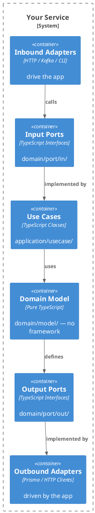

# Hexagonal Architecture for TypeScript / Node.js

Ports & Adapters architecture for testable, framework-independent TypeScript backend services.

> **vs `ddd-typescript`:** This skill focuses on **package structure and dependency direction** — ports (interfaces), adapters (infrastructure), use cases, and DI wiring. Use `ddd-typescript` when you need **domain modeling** — how to design Value Objects, Entities, Aggregates, and Domain Events.

## When to Activate

- Structuring a new TypeScript backend service from scratch
- Reviewing whether domain logic has leaked into adapters (or vice versa)
- Deciding where a new class/function belongs in the package hierarchy
- Writing tests: determining what to mock and at which boundary
- Replacing an adapter (e.g., Prisma → raw SQL) without touching domain

## Core Principle

**Dependency arrows always point inward — toward domain.**



## Package Structure

```
src/
  domain/
    model/          # market.ts, money.ts, MarketStatus.ts
    port/
      in/           # CreateMarketUseCase.ts, ListMarketsUseCase.ts
      out/          # MarketRepository.ts, NotificationPort.ts
    event/          # MarketCreatedEvent.ts
  application/
    usecase/        # CreateMarketService.ts, ListMarketsService.ts
  adapter/
    in/
      http/         # marketRouter.ts, createMarketHandler.ts, marketSchemas.ts
      messaging/    # marketEventConsumer.ts
    out/
      persistence/  # PrismaMarketRepository.ts, SupabaseMarketRepository.ts
      client/       # NotificationClient.ts
  config/           # container.ts  (DI wiring only — no business logic)
```

## Domain Model — No Framework Dependencies

```typescript
// domain/model/market.ts
import type { MarketId } from './MarketId'

export type MarketStatus = 'DRAFT' | 'ACTIVE' | 'SUSPENDED'

export interface Market {
  readonly id: MarketId | null
  readonly name: string
  readonly slug: string
  readonly status: MarketStatus
}

// Factory function — enforces creation invariants
export function createMarket(name: string, slug: string): Market {
  if (!name || name.trim() === '') {
    throw new InvalidMarketError('name is required')
  }
  return { id: null, name: name.trim(), slug, status: 'DRAFT' }
}

// Behavior function — domain logic without mutating the object
export function publishMarket(market: Market): Market {
  if (market.status !== 'DRAFT') {
    throw new MarketAlreadyPublishedError(market.slug)
  }
  return { ...market, status: 'ACTIVE' }
}

// domain/model/MarketId.ts — branded type prevents primitive obsession
export type MarketId = string & { readonly _brand: 'MarketId' }

export function marketId(value: string): MarketId {
  if (!value) throw new Error('MarketId cannot be empty')
  return value as MarketId
}
```

## Input Ports (Use Case Interfaces)

```typescript
// domain/port/in/CreateMarketUseCase.ts
export interface CreateMarketCommand {
  readonly name: string
  readonly slug: string
}

export interface CreateMarketUseCase {
  execute(command: CreateMarketCommand): Promise<Market>
}

// domain/port/in/ListMarketsUseCase.ts
export interface ListMarketsQuery {
  readonly status?: MarketStatus
  readonly limit: number
  readonly offset: number
}

export interface ListMarketsUseCase {
  execute(query: ListMarketsQuery): Promise<Market[]>
}
```

## Output Ports (Repository/External Service Interfaces)

```typescript
// domain/port/out/MarketRepository.ts
export interface MarketRepository {
  save(market: Market): Promise<Market>
  findBySlug(slug: string): Promise<Market | null>
  findAll(status?: MarketStatus, limit?: number, offset?: number): Promise<Market[]>
}

// domain/port/out/NotificationPort.ts
export interface NotificationPort {
  notifyMarketCreated(market: Market): Promise<void>
}
```

## Use Case Implementation

```typescript
// application/usecase/CreateMarketService.ts
// Depends only on domain ports and domain model — no framework imports
import type { CreateMarketUseCase, CreateMarketCommand } from '../../domain/port/in/CreateMarketUseCase'
import type { MarketRepository } from '../../domain/port/out/MarketRepository'
import type { NotificationPort } from '../../domain/port/out/NotificationPort'
import { createMarket } from '../../domain/model/market'

export class CreateMarketService implements CreateMarketUseCase {
  constructor(
    private readonly marketRepository: MarketRepository,  // output port
    private readonly notificationPort: NotificationPort,  // output port
  ) {}

  async execute(command: CreateMarketCommand): Promise<Market> {
    const market = createMarket(command.name, command.slug)
    const saved = await this.marketRepository.save(market)
    await this.notificationPort.notifyMarketCreated(saved)
    return saved
  }
}
```

## Inbound Adapter — HTTP Handler

```typescript
// adapter/in/http/marketSchemas.ts
import { z } from 'zod'

export const createMarketSchema = z.object({
  name: z.string().min(1).max(200),
  slug: z.string().regex(/^[a-z0-9-]+$/),
})

// adapter/in/http/createMarketHandler.ts
import type { Request, Response } from 'express'
import { createMarketSchema } from './marketSchemas'
import type { CreateMarketUseCase } from '../../../domain/port/in/CreateMarketUseCase'

export function createMarketHandler(createMarket: CreateMarketUseCase) {
  return async (req: Request, res: Response, next: NextFunction) => {
    const result = createMarketSchema.safeParse(req.body)
    if (!result.success) {
      // Pass to RFC 7807 error middleware — do not write response here
      return next(result.error)
    }

    try {
      const market = await createMarket.execute(result.data)
      return res.status(201).json(toMarketResponse(market))
    } catch (err) {
      next(err)
    }
  }
}

function toMarketResponse(market: Market) {
  return { name: market.name, slug: market.slug, status: market.status }
}

// adapter/in/http/marketRouter.ts
import { Router } from 'express'
import type { CreateMarketUseCase } from '../../../domain/port/in/CreateMarketUseCase'
import { createMarketHandler } from './createMarketHandler'

export function createMarketRouter(createMarket: CreateMarketUseCase): Router {
  const router = Router()
  router.post('/', createMarketHandler(createMarket))
  return router
}
```

## Error Handling — RFC 7807 / RFC 9457 Problem Details

All HTTP errors must use `Content-Type: application/problem+json`. Register this middleware last in Express (after all routers):

```typescript
// adapter/in/http/problemMiddleware.ts
import type { Request, Response, NextFunction } from 'express'
import { ZodError } from 'zod'
import { InvalidMarketError, MarketAlreadyPublishedError } from '../../../domain/model/market'

export interface ProblemDetails {
  type: string
  title: string
  status: number
  detail?: string
  instance?: string
  [key: string]: unknown
}

function sendProblem(res: Response, status: number, type: string, title: string,
                     detail?: string, extensions?: Record<string, unknown>): void {
  const body: ProblemDetails = { type, title, status, ...(detail && { detail }), ...(extensions ?? {}) }
  res.status(status).contentType('application/problem+json').json(body)
}

export function problemDetailsMiddleware(
  err: unknown, req: Request, res: Response, _next: NextFunction,
): void {
  if (err instanceof ZodError) {
    return sendProblem(res, 400,
      'https://api.example.com/problems/validation-failed', 'Validation Failed',
      'One or more fields failed validation.',
      { errors: err.errors.map(e => ({ field: e.path.join('.'), detail: e.message })) },
    )
  }
  if (err instanceof InvalidMarketError) {
    return sendProblem(res, 422,
      'https://api.example.com/problems/invalid-market-name', 'Invalid Market Name',
      err.message,
    )
  }
  if (err instanceof MarketAlreadyPublishedError) {
    return sendProblem(res, 409,
      'https://api.example.com/problems/already-published', 'Already Published',
      err.message,
    )
  }
  sendProblem(res, 500, 'about:blank', 'Internal Server Error')
}

// In your Express app setup (app.ts):
// app.use('/markets', marketRouter)
// app.use(problemDetailsMiddleware)  ← MUST be after all routers
```

See skill: `problem-details` for the full RFC 7807/9457 specification and field reference.

## Outbound Adapter — Persistence

```typescript
// adapter/out/persistence/PrismaMarketRepository.ts
import type { PrismaClient } from '@prisma/client'
import type { MarketRepository } from '../../../domain/port/out/MarketRepository'
import type { Market, MarketStatus } from '../../../domain/model/market'
import { marketId } from '../../../domain/model/MarketId'

export class PrismaMarketRepository implements MarketRepository {
  constructor(private readonly prisma: PrismaClient) {}

  async save(market: Market): Promise<Market> {
    const row = await this.prisma.market.upsert({
      where: { slug: market.slug },
      create: { name: market.name, slug: market.slug, status: market.status },
      update: { name: market.name, status: market.status },
    })
    return toDomain(row)
  }

  async findBySlug(slug: string): Promise<Market | null> {
    const row = await this.prisma.market.findUnique({ where: { slug } })
    return row ? toDomain(row) : null
  }

  async findAll(status?: MarketStatus, limit = 20, offset = 0): Promise<Market[]> {
    const rows = await this.prisma.market.findMany({
      where: status ? { status } : undefined,
      take: limit,
      skip: offset,
      orderBy: { createdAt: 'desc' },
    })
    return rows.map(toDomain)
  }
}

// Mapper — keeps Prisma types out of the domain
function toDomain(row: { id: string; name: string; slug: string; status: string }): Market {
  return {
    id: marketId(row.id),
    name: row.name,
    slug: row.slug,
    status: row.status as MarketStatus,
  }
}
```

## DI Wiring — No IoC Container Required

```typescript
// config/container.ts
// Manual wiring — explicit, traceable, framework-free
import { PrismaClient } from '@prisma/client'
import { PrismaMarketRepository } from '../adapter/out/persistence/PrismaMarketRepository'
import { NotificationClient } from '../adapter/out/client/NotificationClient'
import { CreateMarketService } from '../application/usecase/CreateMarketService'
import { createMarketRouter } from '../adapter/in/http/marketRouter'

const prisma = new PrismaClient()

// Outbound adapters (implement output ports)
const marketRepository = new PrismaMarketRepository(prisma)
const notificationPort = new NotificationClient()

// Use cases (depend on output port interfaces, not concrete adapters)
export const createMarketUseCase = new CreateMarketService(marketRepository, notificationPort)

// Inbound adapters (depend on input port interfaces)
export const marketRouter = createMarketRouter(createMarketUseCase)
```

## Testing Strategy

### Unit Test — Use Case (no I/O, no framework)

Mock output port interfaces with plain objects — no mocking library needed:

```typescript
// application/usecase/CreateMarketService.test.ts
import { describe, it, expect, vi } from 'vitest'
import { CreateMarketService } from './CreateMarketService'
import type { MarketRepository } from '../../domain/port/out/MarketRepository'
import type { NotificationPort } from '../../domain/port/out/NotificationPort'

const mockRepository: MarketRepository = {
  save: vi.fn().mockImplementation(async (m) => ({ ...m, id: 'market-1' as any })),
  findBySlug: vi.fn(),
  findAll: vi.fn(),
}

const mockNotification: NotificationPort = {
  notifyMarketCreated: vi.fn().mockResolvedValue(undefined),
}

const service = new CreateMarketService(mockRepository, mockNotification)

describe('CreateMarketService', () => {
  it('saves the market and sends notification', async () => {
    const result = await service.execute({ name: 'Test Market', slug: 'test-market' })

    expect(result.name).toBe('Test Market')
    expect(mockRepository.save).toHaveBeenCalledOnce()
    expect(mockNotification.notifyMarketCreated).toHaveBeenCalledOnce()
  })

  it('throws when name is blank', async () => {
    await expect(service.execute({ name: '', slug: 'x' })).rejects.toThrow(InvalidMarketError)
  })
})
```

### Adapter Test — HTTP Handler

Mock the input port, test HTTP concerns only:

```typescript
// adapter/in/http/createMarketHandler.test.ts
import { describe, it, expect, vi } from 'vitest'
import request from 'supertest'
import express from 'express'
import { createMarketRouter } from './marketRouter'
import type { CreateMarketUseCase } from '../../../domain/port/in/CreateMarketUseCase'

const mockUseCase: CreateMarketUseCase = {
  execute: vi.fn().mockResolvedValue({ id: '1', name: 'Test', slug: 'test', status: 'DRAFT' }),
}

const app = express()
app.use(express.json())
app.use('/markets', createMarketRouter(mockUseCase))

describe('POST /markets', () => {
  it('returns 201 with valid payload', async () => {
    const res = await request(app)
      .post('/markets')
      .send({ name: 'Test', slug: 'test' })

    expect(res.status).toBe(201)
    expect(res.body.name).toBe('Test')
  })

  it('returns 400 with invalid slug', async () => {
    const res = await request(app)
      .post('/markets')
      .send({ name: 'Test', slug: 'INVALID SLUG!' })

    expect(res.status).toBe(400)
  })
})
```

### Adapter Test — Persistence (Integration)

Test the Prisma adapter against a real database:

```typescript
// adapter/out/persistence/PrismaMarketRepository.test.ts
// Use Vitest + a test database (Docker or in-memory SQLite for Prisma)
import { describe, it, expect, beforeAll, afterAll } from 'vitest'
import { PrismaClient } from '@prisma/client'
import { PrismaMarketRepository } from './PrismaMarketRepository'
import { createMarket } from '../../../domain/model/market'

const prisma = new PrismaClient({ datasources: { db: { url: process.env.TEST_DATABASE_URL } } })
const repo = new PrismaMarketRepository(prisma)

afterAll(() => prisma.$disconnect())

describe('PrismaMarketRepository', () => {
  it('saves and retrieves by slug', async () => {
    const market = createMarket('Test', 'test-slug')
    await repo.save(market)

    const found = await repo.findBySlug('test-slug')
    expect(found?.name).toBe('Test')
  })
})
```

For common hexagonal architecture anti-patterns (domain importing frameworks, use case depending on concrete adapters, HTTP handler bypassing use cases, Zod validation in domain), see skill `hexagonal-typescript-advanced`.
