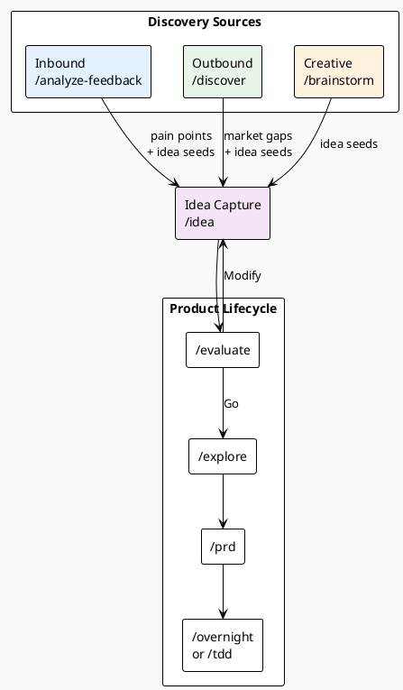

# Idea Discovery Skill

Great products come from finding real problems before competitors do. This skill documents the three modes of proactive idea discovery and how they feed into the product lifecycle.

## When to Activate

- You have user feedback (surveys, support tickets, reviews) to analyze
- You want to understand the competitive landscape in a space
- You need to generate ideas from scratch for a problem domain
- You're blocked on what to build next
- You want to validate that a problem is real before writing a PRD

---

## The Discovery Pipeline



---

## Mode 1: Inbound — Analyze Feedback

**Command:** `/analyze-feedback <file or paste>`

**Agent:** `feedback-analyst` (model: opus)

**When to use:**
- You have real user feedback (support tickets, survey responses, NPS comments, App Store reviews, Intercom logs)
- You want to find patterns in what users complain about
- You want to extract the real job behind a feature request

**What it does:**
1. Semantic clustering — groups feedback by underlying pain, not surface keywords
2. JTBD extraction — turns complaints into "When [X], I want to [Y] so I can [Z]"
3. Pain intensity scoring 1-5
4. Opportunity Score = Frequency × Pain × (1 / Complexity)
5. Creates ranked pain points and idea seeds in `docs/ideas/discovered/`

**Output:** `docs/insights/feedback-YYYY-MM-DD.md`

**Best for:** Understanding what existing users actually suffer from. Ground truth over hypothesis.

---

## Mode 2: Outbound — Competitive Research

**Command:** `/discover <domain or topic>`

**Agent:** `competitive-analyst` (model: opus)

**When to use:**
- Entering a new market or domain
- Checking if a problem space is already saturated
- Finding underserved segments competitors ignore
- Reading competitor strategic signals (job postings, changelogs, pricing changes)

**What it does:**
1. Researches 2-6 competitors systematically (homepage, pricing, changelog, G2/Reddit)
2. Builds a feature matrix (✓ full / ~ partial / ✗ missing)
3. Analyzes positioning: who they serve and what they emphasize
4. Identifies market gaps and underserved segments
5. Creates idea seeds from each gap

**Output:** `docs/insights/discover-YYYY-MM-DD-<topic>.md`

**Best for:** Finding what nobody does well. Gaps beat head-to-head competition.

---

## Mode 3: Creative — Structured Ideation

**Command:** `/brainstorm <problem space>`

**When to use:**
- You have a domain but no data (early stage, pivoting, exploring)
- You want diverse ideas across multiple ideation angles
- You want to stress-test a problem space before committing to research

**What it does — 4 frameworks in sequence:**

| Framework | Question | Output type |
|-----------|----------|-------------|
| Jobs-to-be-Done | "What job is the user hiring a product to do?" | Functional need |
| How Might We | "HMW make X better?" | Solution direction |
| Analogy Thinking | "How does another industry solve this?" | Mechanism transfer |
| Constraint Reversal | "What if we removed [assumed constraint]?" | Breakthrough idea |

Generates 15-25 raw ideas, filters to top 7 by novelty + JTBD fit + feasibility + market signal.

**Output:** 7 idea seeds in `docs/ideas/discovered/`

**Best for:** Early-stage exploration, creativity unblocking, pivots.

---

## Choosing the Right Mode

| Situation | Use |
|-----------|-----|
| Have user feedback data | `/analyze-feedback` |
| Entering a competitive market | `/discover` |
| No data, need ideas fast | `/brainstorm` |
| Want all angles | Run all three, then `/brainstorm` with inputs from the others |
| Know the problem, need the solution | Skip to `/idea` → `/evaluate` |

---

## Idea Seeds

All three discovery modes produce **idea seeds** — small structured files saved to `docs/ideas/discovered/`:

```markdown
# Idea: <name>

**Core insight:** <the non-obvious thing — one sentence>
**Job solved:** "When [X], I want to [Y] so I can [Z]"
**Different from existing:** <what no current solution does>
**Riskiest assumption:** <what must be true for this to work>
**Source:** <feedback analysis | competitive gap | brainstorm>
**Discovery date:** YYYY-MM-DD
```

These are inputs to `/idea`, which formalizes them and kicks off the lifecycle.

---

## Full Discovery → Lifecycle Example

```bash
# Step 1: Discover ideas from multiple angles
/analyze-feedback docs/feedback/q4-survey.csv
/discover "developer error monitoring"
/brainstorm "help developers understand production errors faster"

# Step 2: Review idea seeds (in docs/ideas/discovered/)
# Pick the most compelling ones

# Step 3: Enter the product lifecycle
/idea smart-error-grouping
/evaluate smart-error-grouping
# → Go / No-Go / Modify

# Step 4: If Go
/explore smart-error-grouping
/prd smart-error-grouping

# Step 5: Implement
/overnight smart-error-grouping
# or: /tdd smart-error-grouping
```

---

## Anti-Patterns

- **Skipping discovery** — building what seems obvious without checking user data or the competitive landscape
- **Analyzing too long** — discovery is an input, not the product. Cap at 2-3 sessions per cycle
- **Over-indexing on one mode** — feedback tells you about existing users; competitive tells you about the market; brainstorm tells you what's possible. Use all three
- **Treating idea seeds as commitments** — they're hypotheses. Most won't survive `/evaluate`
- **Copying competitors** — competitive research surfaces gaps, not features to clone
