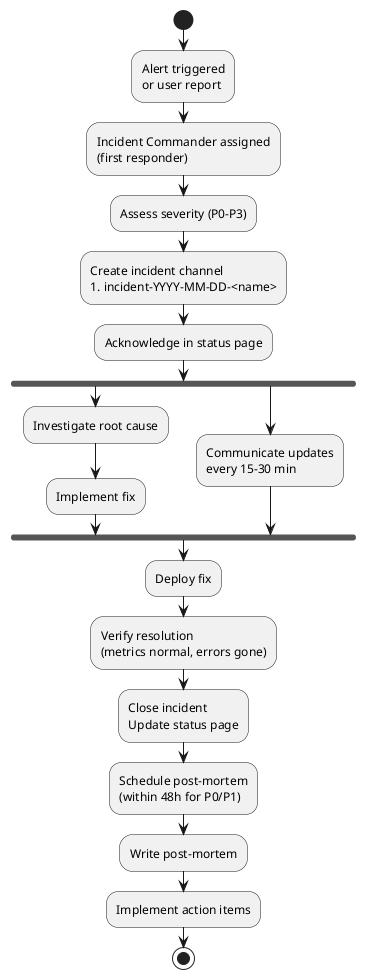

# Incident Response Skill

When production breaks, you need a process — not improvisation. A clear incident response prevents panic, reduces MTTR (Mean Time To Resolve), and builds learning culture.

## When to Activate

- Something is broken in production
- User reports, alerts, or monitoring triggered
- Running `/incident` command
- Writing a post-mortem after an incident
- Setting up on-call rotation
- Creating runbooks for known failure modes

---

## Severity Levels

| Level | Definition | Response Time | Examples |
|-------|-----------|--------------|---------|
| **P0** | Complete outage, all users affected | Immediate (< 5 min) | Site down, no logins work, payments failing 100% |
| **P1** | Major feature broken, many users affected | 15 minutes | Checkout failing, auth broken for 50% users |
| **P2** | Minor feature degraded, some users affected | 1 hour | Slow queries, exports failing, non-critical feature down |
| **P3** | Cosmetic issue, workaround exists | Next business day | Wrong label, pagination off by one |

---

## Incident Lifecycle



---

## Incident Document Template

Create `docs/incidents/YYYY-MM-DD-<name>.md`:

```markdown
# Incident: <Short Description>

**Date:** YYYY-MM-DD
**Severity:** P0 / P1 / P2 / P3
**Status:** INVESTIGATING / RESOLVED
**Incident Commander:** <name>
**Duration:** HH:MM (from detection to resolution)

## Impact

- **What broke:** <description>
- **Who was affected:** <user count / percentage>
- **Business impact:** <revenue loss, SLA breach, user-visible symptoms>

## Timeline

| Time (UTC) | Event |
|-----------|-------|
| HH:MM | Alert triggered / User reported |
| HH:MM | Incident Commander assigned |
| HH:MM | Root cause hypothesized: <hypothesis> |
| HH:MM | Fix deployed |
| HH:MM | Incident resolved |

## Root Cause

<What actually caused this. Be specific. "Database was overloaded" is not enough.
"A missing index on orders.created_at caused a full table scan on a 10M row table,
triggered by the new reporting query added in PR #234" is.>

## Resolution

<What was done to fix it. Step-by-step.>

## Detection Gap

<How long between problem start and detection? How could we have caught it faster?>

## Contributing Factors

- <factor 1>
- <factor 2>

## Action Items

| Action | Owner | Due | Ticket |
|--------|-------|-----|--------|
| Add index on orders.created_at | @alice | YYYY-MM-DD | #456 |
| Add query time alert (p95 > 500ms) | @bob | YYYY-MM-DD | #457 |
```

---

## Communication Templates

### Status Page (initial)

```
🔴 Investigating — [Service Name] Degraded
We are aware of an issue affecting [feature]. Our team is investigating.
Impact: [describe]
Next update: [time]
```

### Status Page (update)

```
🟡 Update — [Service Name] Degraded
We have identified the root cause: [1 sentence].
We are deploying a fix. ETA: [time].
Next update: [time]
```

### Status Page (resolved)

```
🟢 Resolved — [Service Name] Operational
The issue affecting [feature] has been resolved.
Duration: [start] – [end] ([X hours Y minutes])
Root cause: [1 sentence]
Post-mortem will be published within 48 hours.
```

### Slack Incident Channel

```
🚨 INCIDENT P1: Checkout Failing
Commander: @alice
Channel: #incident-2026-03-06-checkout
Status page: https://status.yourapp.com

What we know:
- 30% of checkout attempts failing with 500
- Started ~14:30 UTC
- PR #289 deployed at 14:25 UTC

Investigating now. Updates every 15 min.
```

---

## Runbook Template

Create per-service runbooks at `docs/runbooks/<service>/<failure-mode>.md`:

```markdown
# Runbook: Database Connection Pool Exhausted

**Service:** order-service
**Symptom:** Requests timeout, logs show "Connection pool timeout"

## Immediate Actions (< 5 min)

1. Check connection count:
   ```sql
   SELECT count(*) FROM pg_stat_activity WHERE datname = 'production';
   ```
   Normal: < 80. Critical: > 95.

2. Check for long-running queries:
   ```sql
   SELECT pid, now() - pg_stat_activity.query_start AS duration, query
   FROM pg_stat_activity
   WHERE (now() - pg_stat_activity.query_start) > interval '1 minute';
   ```

3. Kill blocking queries (if safe):
   ```sql
   SELECT pg_terminate_backend(<pid>);
   ```

## If Not Resolved in 10 min

4. Scale up connection pool (PgBouncer):
   ```bash
   kubectl scale deployment pgbouncer --replicas=3
   ```

5. Restart service pod (last resort):
   ```bash
   kubectl rollout restart deployment/order-service
   ```

## Root Cause Investigation

- Check which queries are taking longest (pg_stat_statements)
- Check if recent deploy changed query patterns
- Check if cron job or batch job is holding connections

## Escalation

If not resolved in 20 min: page @alice (database lead)
```

---

## Blameless Post-Mortem

**Goal:** Learn, not blame. Systems fail. People trying to fix systems under pressure make mistakes.

**Rules:**
- Assume everyone acted with good intent and best knowledge at the time
- Focus on system factors, not individual blame
- "The engineer didn't check" → "The deployment checklist didn't include this check"
- Action items fix systems, not people

### Post-Mortem Format

```markdown
# Post-Mortem: <Incident Title>

**Date:** YYYY-MM-DD
**Severity:** P1
**Duration:** 47 minutes
**Author:** <incident commander>
**Reviewed by:** <team>

## Executive Summary

<3-4 sentences: what broke, how long, what fixed it, primary learning>

## What Went Well

- Alert fired within 2 minutes of degradation starting
- Clear communication to users via status page
- Fix deployed in < 30 minutes of root cause identification

## What Went Wrong

- Missing index caused full table scan at scale
- No query time alert — only error rate alert
- PR review didn't catch the missing index

## Root Cause Analysis (5 Whys)

1. **Why did users see errors?** → Database queries timing out
2. **Why were queries timing out?** → Full table scan on 10M rows
3. **Why was there a full table scan?** → Missing index on orders.created_at
4. **Why was the index missing?** → Added query without checking query plan
5. **Why was the query plan not checked?** → No query plan check in PR review process

## Action Items

| Priority | Action | Owner | Due |
|----------|--------|-------|-----|
| P0 | Add index on orders.created_at | @alice | Today |
| P1 | Add p95 latency alert (threshold: 500ms) | @bob | This week |
| P2 | Add EXPLAIN to PR template for DB queries | @alice | Next sprint |
| P3 | Document query plan review in coding standards | @alice | Next sprint |
```

---

## Checklist: Incident Response Setup

- [ ] On-call rotation defined (who is primary, who is secondary)
- [ ] Alerting configured (error rate, latency, service-down — see `observability`)
- [ ] Status page set up (Statuspage.io, Instatus, or self-hosted)
- [ ] Runbooks written for known failure modes (DB, cache, queue)
- [ ] Incident document template available
- [ ] Post-mortem template available
- [ ] Post-mortems shared with team (learning, not blame)
- [ ] Action items tracked in issue tracker (not just the post-mortem doc)
