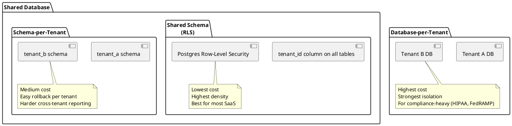

# Multi-Tenancy Skill

SaaS products serve multiple customers on shared infrastructure. The most important property: tenant A can never see tenant B's data.

## When to Activate

- Building a B2B SaaS product
- Adding multi-organization support to an existing app
- Implementing Postgres Row-Level Security
- Testing tenant data isolation
- Migrating from single-tenant to multi-tenant architecture

---

## Isolation Models



**Default choice:** Shared database + Row-Level Security. Only diverge for compliance requirements.

---

## Pattern 1: Row-Level Security (Postgres)

### Schema Setup

```sql
-- Every table has a tenant_id column
CREATE TABLE orders (
    id          UUID PRIMARY KEY DEFAULT gen_random_uuid(),
    tenant_id   UUID NOT NULL REFERENCES tenants(id),
    user_id     UUID NOT NULL,
    total       NUMERIC(12,2),
    created_at  TIMESTAMPTZ DEFAULT now()
);

-- Index for every tenant_id (performance critical)
CREATE INDEX idx_orders_tenant_id ON orders (tenant_id);

-- Enable RLS
ALTER TABLE orders ENABLE ROW LEVEL SECURITY;

-- Policy: users can only see their tenant's rows
CREATE POLICY tenant_isolation ON orders
    USING (tenant_id = current_setting('app.tenant_id')::UUID);

-- Grant access to app user (RLS applies to non-superusers)
GRANT SELECT, INSERT, UPDATE, DELETE ON orders TO app_user;
```

### Setting Tenant Context

```typescript
// Set app.tenant_id before every query in the transaction
export async function withTenantContext<T>(
  tenantId: string,
  fn: (tx: Transaction) => Promise<T>
): Promise<T> {
  return db.transaction(async (tx) => {
    await tx.execute(sql`SET LOCAL app.tenant_id = ${tenantId}`);
    return fn(tx);
  });
}

// Middleware: extract tenant from JWT/session, set context
export async function tenantMiddleware(req, res, next) {
  const tenantId = req.user?.tenantId;
  if (!tenantId) return res.status(401).json(problem(401, 'No tenant context'));

  req.db = {
    // All queries in this request run within tenant context
    query: (fn) => withTenantContext(tenantId, fn),
  };
  next();
}

// Handler — no explicit tenant_id needed, RLS handles it
app.get('/api/v1/orders', tenantMiddleware, async (req, res) => {
  const orders = await req.db.query((tx) =>
    tx.select().from(ordersTable)  // RLS automatically filters to tenant
  );
  res.json({ data: orders });
});
```

### Testing Tenant Isolation

```typescript
it('cannot see another tenant\'s orders', async () => {
  const tenantA = await createTenant();
  const tenantB = await createTenant();

  const order = await withTenantContext(tenantA.id, (tx) =>
    tx.insert(orders).values({ tenantId: tenantA.id, total: 100 }).returning()
  );

  // Query as tenant B — should see no orders
  const result = await withTenantContext(tenantB.id, (tx) =>
    tx.select().from(orders)
  );

  expect(result).toHaveLength(0);
});

it('cannot insert into another tenant\'s data', async () => {
  const tenantA = await createTenant();
  const tenantB = await createTenant();

  // Try to insert order for tenant A while acting as tenant B
  await expect(
    withTenantContext(tenantB.id, (tx) =>
      tx.insert(orders).values({ tenantId: tenantA.id, total: 100 })
    )
  ).rejects.toThrow();  // RLS blocks the insert
});
```

---

## Pattern 2: Schema-per-Tenant

```typescript
// Migration per tenant
async function provisionTenant(tenantSlug: string) {
  const schema = `tenant_${tenantSlug}`;
  await db.execute(sql`CREATE SCHEMA IF NOT EXISTS ${sql.identifier(schema)}`);

  // Run migrations in tenant schema
  await migrator.migrate({ schema });
}

// Query in tenant schema
function tenantDb(tenantSlug: string) {
  const schema = `tenant_${tenantSlug}`;
  return drizzle(pool, { schema: { ...tables }, logger: false })
    .withSearchPath(schema);  // All queries run in this schema
}
```

---

## Tenant Resolution

How do you know which tenant is making the request?

| Method | Example | Best For |
|--------|---------|---------|
| Subdomain | `acme.myapp.com` | B2B SaaS |
| Custom domain | `app.acme.com` | White-label |
| Path prefix | `/org/acme/dashboard` | Simple multi-user |
| JWT claim | `{ tenant: "acme-id" }` | API-first |
| API key lookup | key → tenant in DB | Server-to-server |

```typescript
// Subdomain resolution
function resolveTenant(req: Request): string {
  const host = req.hostname;  // e.g. "acme.myapp.com"
  const subdomain = host.split('.')[0];
  if (['www', 'app', 'api'].includes(subdomain)) {
    throw new Error('No tenant in subdomain');
  }
  return subdomain;
}
```

---

## Checklist

- [ ] Every table has `tenant_id` column with NOT NULL constraint
- [ ] Every `tenant_id` column has an index
- [ ] RLS enabled and policies created on all tenant-scoped tables
- [ ] Tenant context set before every query (not per-query `WHERE tenant_id =`)
- [ ] Tenant isolation tests exist (tenant A cannot read/write tenant B's data)
- [ ] No raw SQL queries that bypass the ORM and skip RLS
- [ ] Superuser role NOT used by application (RLS bypassed for superusers)
- [ ] Audit log tracks cross-tenant admin operations separately
