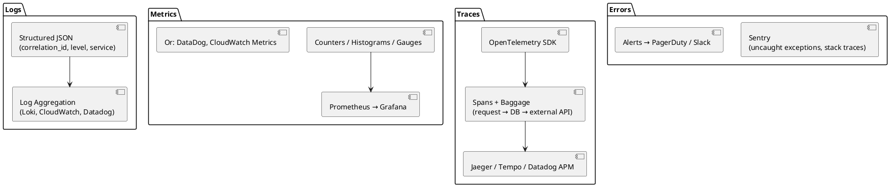

# Observability Skill

The three pillars of production visibility: **Logs** (what happened), **Metrics** (how often / how fast), **Traces** (why was this request slow). Without observability, production is a black box.

## When to Activate

- Setting up a new service for production
- Debugging production issues without enough information
- Adding monitoring or alerting to an existing service
- Implementing health checks (readiness/liveness probes)
- Setting up error tracking (Sentry, Honeybadger)
- Integrating OpenTelemetry tracing
- Adding structured logging to replace printf-style logs

---

## The Three Pillars



---

## Pillar 1: Structured Logging

### Rules

1. **Always JSON in production** — never plain text (machines must parse it)
2. **Correlation ID on every log line** — generated at request entry, propagated through all calls
3. **Standard fields on every log**: `timestamp`, `level`, `service`, `correlation_id`, `message`
4. **No PII in logs** — no emails, passwords, tokens, credit card numbers
5. **Log at the right level**: DEBUG (dev), INFO (normal ops), WARN (recoverable), ERROR (action needed)

### TypeScript (pino)

```typescript
import pino from 'pino';
import { randomUUID } from 'crypto';

export const logger = pino({
  level: process.env.LOG_LEVEL ?? 'info',
  base: { service: 'order-service', env: process.env.NODE_ENV },
  formatters: {
    level: (label) => ({ level: label }),
  },
});

// Middleware: attach correlation ID
export function correlationMiddleware(req, res, next) {
  const correlationId = req.headers['x-correlation-id'] ?? randomUUID();
  res.setHeader('x-correlation-id', correlationId);
  req.log = logger.child({ correlation_id: correlationId, path: req.path });
  next();
}

// Usage
req.log.info({ order_id: order.id }, 'Order created');
req.log.error({ err, order_id }, 'Failed to process payment');
```

### Python (structlog)

```python
import structlog
import uuid

structlog.configure(
    processors=[
        structlog.contextvars.merge_contextvars,
        structlog.processors.add_log_level,
        structlog.processors.TimeStamper(fmt="iso"),
        structlog.processors.JSONRenderer(),
    ]
)
log = structlog.get_logger()

# Middleware (FastAPI)
@app.middleware("http")
async def correlation_middleware(request: Request, call_next):
    correlation_id = request.headers.get("x-correlation-id", str(uuid.uuid4()))
    structlog.contextvars.bind_contextvars(
        correlation_id=correlation_id,
        service="order-service",
        path=str(request.url.path),
    )
    response = await call_next(request)
    response.headers["x-correlation-id"] = correlation_id
    return response

# Usage
log.info("order_created", order_id=order.id)
log.error("payment_failed", order_id=order.id, error=str(e))
```

### Go (slog / zap)

```go
import (
    "log/slog"
    "os"
    "github.com/google/uuid"
)

var log = slog.New(slog.NewJSONHandler(os.Stdout, &slog.HandlerOptions{
    Level: slog.LevelInfo,
})).With("service", "order-service")

// Middleware
func CorrelationMiddleware(next http.Handler) http.Handler {
    return http.HandlerFunc(func(w http.ResponseWriter, r *http.Request) {
        correlationID := r.Header.Get("X-Correlation-ID")
        if correlationID == "" {
            correlationID = uuid.New().String()
        }
        w.Header().Set("X-Correlation-ID", correlationID)
        ctx := context.WithValue(r.Context(), "correlation_id", correlationID)
        reqLog := log.With("correlation_id", correlationID, "path", r.URL.Path)
        ctx = context.WithValue(ctx, "logger", reqLog)
        next.ServeHTTP(w, r.WithContext(ctx))
    })
}

// Usage
reqLog.Info("order created", "order_id", order.ID)
reqLog.Error("payment failed", "order_id", order.ID, "err", err)
```

---

## Pillar 2: Metrics

### What to Measure (USE + RED Method)

**USE** (for resources — CPU, memory, DB connections):
- **U**tilization — how busy is the resource?
- **S**aturation — how much work is queued?
- **E**rrors — how often does it fail?

**RED** (for services — HTTP handlers, queues):
- **R**ate — requests per second
- **E**rrors — error rate (%)
- **D**uration — latency (p50, p95, p99)

### TypeScript (prom-client)

```typescript
import { Counter, Histogram, register } from 'prom-client';

export const httpRequestsTotal = new Counter({
  name: 'http_requests_total',
  help: 'Total number of HTTP requests',
  labelNames: ['method', 'route', 'status_code'],
});

export const httpRequestDuration = new Histogram({
  name: 'http_request_duration_seconds',
  help: 'HTTP request latency in seconds',
  labelNames: ['method', 'route'],
  buckets: [0.005, 0.01, 0.025, 0.05, 0.1, 0.25, 0.5, 1, 2.5],
});

// Middleware
app.use((req, res, next) => {
  const end = httpRequestDuration.startTimer({ method: req.method, route: req.route?.path ?? req.path });
  res.on('finish', () => {
    httpRequestsTotal.inc({ method: req.method, route: req.route?.path ?? req.path, status_code: res.statusCode });
    end();
  });
  next();
});

// Metrics endpoint
app.get('/metrics', async (req, res) => {
  res.set('Content-Type', register.contentType);
  res.end(await register.metrics());
});
```

### Go (prometheus/client_golang)

```go
var (
    httpRequests = prometheus.NewCounterVec(prometheus.CounterOpts{
        Name: "http_requests_total",
        Help: "Total HTTP requests",
    }, []string{"method", "route", "status"})

    httpDuration = prometheus.NewHistogramVec(prometheus.HistogramOpts{
        Name:    "http_request_duration_seconds",
        Help:    "HTTP request duration",
        Buckets: prometheus.DefBuckets,
    }, []string{"method", "route"})
)

func init() {
    prometheus.MustRegister(httpRequests, httpDuration)
}

// Prometheus endpoint
http.Handle("/metrics", promhttp.Handler())
```

---

## Pillar 3: Distributed Tracing (OpenTelemetry)

### Why Traces

When a request hits your API, it may call 3 services and 5 DB queries. A trace shows exactly where the time went. Essential for debugging latency in distributed systems.

### TypeScript

```typescript
import { NodeSDK } from '@opentelemetry/sdk-node';
import { getNodeAutoInstrumentations } from '@opentelemetry/auto-instrumentations-node';
import { OTLPTraceExporter } from '@opentelemetry/exporter-trace-otlp-http';

const sdk = new NodeSDK({
  traceExporter: new OTLPTraceExporter({
    url: process.env.OTEL_EXPORTER_OTLP_ENDPOINT ?? 'http://localhost:4318/v1/traces',
  }),
  instrumentations: [getNodeAutoInstrumentations()],
  serviceName: 'order-service',
});

sdk.start();

// Manual spans for business operations
import { trace } from '@opentelemetry/api';
const tracer = trace.getTracer('order-service');

async function processOrder(orderId: string) {
  return tracer.startActiveSpan('processOrder', async (span) => {
    span.setAttribute('order.id', orderId);
    try {
      const result = await doWork();
      span.setStatus({ code: SpanStatusCode.OK });
      return result;
    } catch (err) {
      span.recordException(err);
      span.setStatus({ code: SpanStatusCode.ERROR });
      throw err;
    } finally {
      span.end();
    }
  });
}
```

### Go

```go
import (
    "go.opentelemetry.io/otel"
    "go.opentelemetry.io/otel/exporters/otlp/otlptrace/otlptracehttp"
)

// Setup (call once in main)
exporter, _ := otlptracehttp.New(ctx)
tp := trace.NewTracerProvider(trace.WithBatcher(exporter))
otel.SetTracerProvider(tp)

// Usage
tracer := otel.Tracer("order-service")
ctx, span := tracer.Start(ctx, "processOrder")
defer span.End()
span.SetAttributes(attribute.String("order.id", orderID))
```

---

## Error Tracking (Sentry)

```typescript
// TypeScript
import * as Sentry from '@sentry/node';

Sentry.init({
  dsn: process.env.SENTRY_DSN,
  environment: process.env.NODE_ENV,
  tracesSampleRate: process.env.NODE_ENV === 'production' ? 0.1 : 1.0,
  integrations: [Sentry.httpIntegration(), Sentry.expressIntegration()],
});

// Capture manually
try {
  await riskyOperation();
} catch (err) {
  Sentry.captureException(err, { extra: { orderId } });
  throw err;
}
```

```python
# Python
import sentry_sdk
from sentry_sdk.integrations.fastapi import FastApiIntegration

sentry_sdk.init(
    dsn=os.environ["SENTRY_DSN"],
    environment=os.getenv("ENV", "development"),
    traces_sample_rate=0.1,
    integrations=[FastApiIntegration()],
)
```

---

## Health Checks

Every service MUST expose health endpoints for orchestrators (Kubernetes, ECS, etc.):

```typescript
// TypeScript
app.get('/health/live', (req, res) => {
  // Liveness: am I running? Just return 200.
  res.json({ status: 'ok' });
});

app.get('/health/ready', async (req, res) => {
  // Readiness: can I serve traffic? Check dependencies.
  try {
    await db.query('SELECT 1');
    await redis.ping();
    res.json({ status: 'ok', checks: { db: 'ok', redis: 'ok' } });
  } catch (err) {
    res.status(503).json({ status: 'degraded', error: err.message });
  }
});
```

| Endpoint | Answers | Kubernetes action on failure |
|----------|---------|------------------------------|
| `/health/live` | Is the process alive? | Restart the container |
| `/health/ready` | Can I serve traffic? | Remove from load balancer |

---

## Alerting Rules (Prometheus/Alertmanager)

```yaml
# alerts.yaml
groups:
  - name: service-alerts
    rules:
      - alert: HighErrorRate
        expr: rate(http_requests_total{status_code=~"5.."}[5m]) / rate(http_requests_total[5m]) > 0.01
        for: 2m
        labels:
          severity: critical
        annotations:
          summary: "Error rate > 1% for 2 minutes"

      - alert: HighLatency
        expr: histogram_quantile(0.95, rate(http_request_duration_seconds_bucket[5m])) > 0.5
        for: 5m
        labels:
          severity: warning
        annotations:
          summary: "p95 latency > 500ms"

      - alert: ServiceDown
        expr: up == 0
        for: 1m
        labels:
          severity: critical
        annotations:
          summary: "Service is down"
```

---

## Observability Checklist

Before deploying to production:

- [ ] Structured JSON logging with correlation ID
- [ ] No PII in log messages
- [ ] RED metrics (rate, errors, duration) on all HTTP handlers
- [ ] `/health/live` and `/health/ready` endpoints
- [ ] Sentry (or equivalent) initialized with DSN from env
- [ ] OpenTelemetry configured (or at minimum, pino-http request logging)
- [ ] Alerts defined for error rate, latency, and service-down
- [ ] Dashboards created (or Grafana template applied)
- [ ] Log retention configured (don't keep raw logs forever — cost)
- [ ] Sampling configured for traces in production (not 100%)
