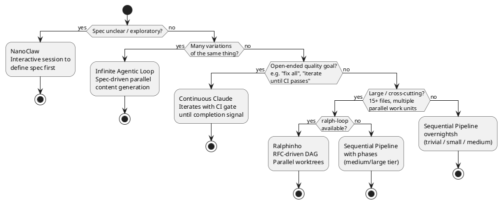
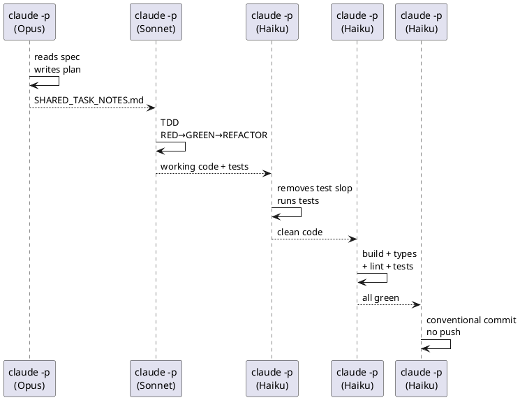
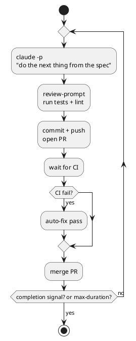
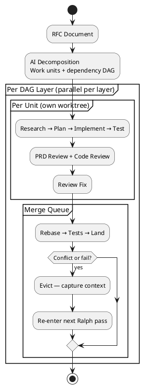
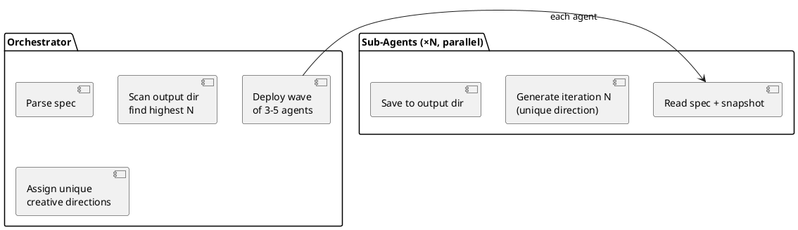

# Overnight Pipeline Skill

A meta-pipeline that decides *which* autonomous pattern fits your feature before setting anything up. You describe an idea; it picks Sequential Pipeline, Continuous Claude, Ralphinho, or Infinite Agentic Loop based on signals in the description and codebase.

## When to Activate

- User says "overnight", "run while I sleep", "autonomous", "unattended", "can this run itself"
- User invokes `/overnight <feature description>`
- User asks how to automate a development pipeline
- User asks which loop pattern to use for a task

---

## Pattern Selection

The command evaluates the feature description and codebase against these signals — in order:



### Signal Reference

| Signal | Keywords / Indicators | Pattern |
|--------|----------------------|---------|
| Exploratory | "not sure", "explore", "investigate", "try out" | NanoClaw |
| Well-defined, bounded | Clear acceptance criteria, single module, < 10 files | Sequential |
| Open-ended iteration | "fix all", "improve coverage", "keep going until done" | Continuous Claude |
| CI-gate needed | Success = CI green, not just local tests | Continuous Claude |
| Parallel units | Multiple independent components, "across services" | Ralphinho |
| Large scope | 15+ files, "redesign", "migrate", "entire system" | Ralphinho |
| Many variations | "generate N", "10 versions", "batch", "content" | Infinite Loop |

### Complexity Tiers (Sequential Pipeline)

| Tier | Scope | Steps Generated |
|------|-------|----------------|
| trivial | 1-2 files, single function | implement → verify → commit |
| small | 2-5 files, one module | plan → implement → verify → commit |
| medium | 5-15 files, multiple modules | plan → [api-contract] → implement → de-sloppify → verify → commit |
| large | 15+ files, cross-cutting | plan → [api-contract] → implement → de-sloppify → verify → commit + Ralphinho if available |

---

## The Four Patterns

### 1. Sequential Pipeline (`overnight.sh`)

Best for: single, well-defined features with clear acceptance criteria.



Generated: `scripts/overnight.sh`, `docs/specs/`, `SHARED_TASK_NOTES.md`

---

### 2. Continuous Claude

Best for: open-ended quality goals, iterative fixes, tasks where "done" = CI passing.



Generated: `scripts/overnight.sh` (wraps `continuous-claude`), `docs/specs/`, `SHARED_TASK_NOTES.md`

Key flags:
```bash
continuous-claude \
  --prompt "..." \
  --max-duration 6h \
  --max-cost 5.00 \
  --completion-signal "OVERNIGHT_PIPELINE_COMPLETE" \
  --completion-threshold 2 \
  --review-prompt "bun test && bun lint"
```

---

### 3. Ralphinho (RFC-Driven DAG)

Best for: large features with parallel work units, multiple interdependent components, real risk of merge conflicts.



Generated: `docs/rfc-<feature>.md` (RFC document for AI decomposition), instructions for starting ralph-loop

---

### 4. Infinite Agentic Loop

Best for: generating many variations of the same spec (components, tests, content, examples).



Generated: `.claude/commands/overnight-loop.md` (project command)

---

## The Context Bridge: SHARED_TASK_NOTES.md

The key pattern that makes multi-step autonomous work reliable. Each `claude -p` call starts with a fresh context window — `SHARED_TASK_NOTES.md` is how steps communicate:

```
Step 0 (Plan)     → writes implementation plan
Step 2 (Impl)     → reads plan, writes "what was done / what remains"
Step 3 (Cleanup)  → reads status, updates
Step 4 (Verify)   → reads status, logs failures and fixes
Step 5 (Commit)   → reads all notes → accurate commit message
```

### Template

```markdown
# Overnight Pipeline — <Feature Name>

**Pattern:** Sequential (medium)
**Started:** 2025-03-05T21:00:00Z
**Spec:** docs/specs/overnight-2025-03-05-oauth2-login.md

## Status

- [x] Step 0: Plan
- [x] Step 1: API Contract
- [x] Step 2: Implementation (TDD)
- [ ] Step 3: De-Sloppify
- [ ] Step 4: Verify
- [ ] Step 5: Commit

## Implementation Plan

(written by Step 0)

## Decisions Made

- Used existing SessionsTable — avoids new migration
- Rate limit callback at 10 req/min using existing RateLimiter middleware

## Issues Encountered

- GitHub returned 422 on malformed state param — added validation in callback

## What Was Done

- src/auth/github.ts (OAuth2 flow)
- src/routes/auth.ts (added /auth/github + /auth/github/callback)
- tests/auth/github.test.ts (12 tests, all passing)

## What Remains

- De-sloppify: remove console.log on line 47
- Verify: full build not run yet
```

---

## Writing an Effective Spec

The spec is the only thing Claude has when the pipeline starts. Concrete > Vague.

```markdown
# Overnight Spec: OAuth2 Login with GitHub

## Goal

Users can log in using their GitHub account. On first login, a new user account
is created. On subsequent logins, the existing account is used.

## Scope

### In Scope
- GitHub OAuth2 flow (authorization + callback)
- User creation on first login
- Session token as httpOnly cookie

### Out of Scope
- Other OAuth providers (Google, Apple)
- Email/password login changes

## Acceptance Criteria

- [ ] GET /api/v1/auth/github redirects to GitHub with correct scopes
- [ ] GET /api/v1/auth/github/callback exchanges code for token
- [ ] New users created with GitHub profile data
- [ ] Existing users matched by GitHub ID (not email)
- [ ] Tests pass with 80%+ coverage on new code

## Notes for Claude

- Read src/auth/local.ts to understand existing auth patterns
- Use existing RateLimiter from src/middleware/rate-limit.ts
- Sessions use the sessions table — do not add a new tokens table
```

---

## Model Routing

| Step | Model | Reason |
|------|-------|--------|
| Plan | Claude Opus (most capable tier) | Deep architectural reasoning |
| API Contract | Claude Sonnet (balanced tier) | Standard, fast |
| Implement | Claude Sonnet (balanced tier) | Fast, capable |
| De-Sloppify | Claude Haiku (fast tier) | Simple pattern matching |
| Verify | Claude Haiku (fast tier) | Runs commands, interprets output |
| Commit | Claude Haiku (fast tier) | Summarization task |

For large/complex features, upgrade Implement to Opus:
```bash
# Use current Claude Opus model ID from anthropic.com/api
claude -p --model <claude-opus-model-id> "Implement the payment reconciliation logic..."
```

---

## Morning Review Checklist

```bash
# 1. What happened
git log --oneline -5
cat SHARED_TASK_NOTES.md

# 2. What changed
git diff HEAD~1

# 3. Any issues in the log
grep -E "ERROR|WARN|FAIL" logs/overnight-*.log

# 4. Verify locally
bun test  # or your test command

# 5. Ship when ready
git push origin <branch>
gh pr create
```

---

## Anti-Patterns

| Anti-Pattern | Problem | Fix |
|-------------|---------|-----|
| No spec file | Claude guesses intent | Write spec before confirming |
| One giant `claude -p` prompt | Context overflow, no checkpoints | Split into 4-6 focused steps |
| No SHARED_TASK_NOTES.md | Each step starts blind | Bridge every step via notes |
| Pattern mismatch | Continuous Claude for a simple feature wastes cost; Sequential for "fix all 47 issues" fails at iteration 1 | Let `/overnight` analyze first |
| Push inside the script | Can't review before shipping | Commit only; push manually |
| No `set -euo pipefail` | Silent failures cascade | Always use strict mode |
| No log file | Can't debug what happened overnight | `tee -a "$LOG_FILE"` on every call |

---

## Quick Start

```
/overnight implement OAuth2 login with GitHub
```

Claude analyzes → presents pattern decision → waits for confirmation → generates files.

Then:
```bash
./scripts/overnight.sh          # start
tail -f logs/overnight-*.log    # monitor (optional)
```

Tomorrow:
```bash
git log --oneline -3
cat SHARED_TASK_NOTES.md
git diff HEAD~1
```

---

## Related Skills

- `autonomous-loops` — full pattern library and reference implementations
- `api-contract` — invoked in the API Contract step when endpoints change
- `plankton-code-quality` — quality standards applied in the De-Sloppify step
