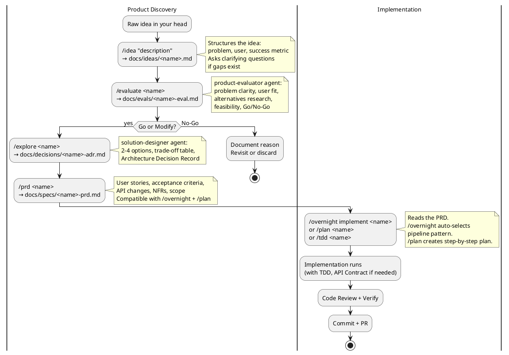
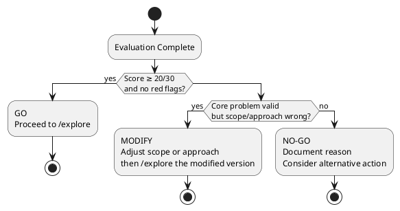

# Product Lifecycle Skill

The complete workflow from "I have an idea" to "code is shipped." Ensures that every feature is evaluated before it's built, every solution is chosen deliberately, and every implementation starts with a clear spec.

## When to Activate

- User mentions a product idea, feature request, or "we should build X"
- User invokes `/idea`, `/evaluate`, `/explore`, or `/prd`
- User asks "is this worth building?" or "what's the best approach for X?"
- User wants to understand the full development process
- Multiple solution approaches exist and a trade-off analysis is needed before coding begins
- Acceptance criteria are missing or too vague to guide implementation
- Stakeholders need to align on scope before engineering work starts
- A feature was built but its value or success metrics were never defined

---

## Quick Decision Flow

**Right now, which stage are you in?**

```
1. Have a raw idea or feature request?
   → /idea "<description>"       (produces docs/ideas/<name>.md)

2. Idea documented but not evaluated?
   → /evaluate <name>            (Go / No-Go / Modify from product-evaluator agent)
   → If No-Go: STOP. Document why. Do not build.

3. Got a Go or Modify? Need to pick an approach?
   → /explore <name>             (2-4 options + ADR from solution-designer agent)

4. Approach chosen? Need a spec?
   → /prd <name>                 (PRD with user stories + acceptance criteria)

5. PRD ready? Time to implement?
   → /overnight <name>           (autonomous pipeline, reads PRD)
   → /plan <name>                (step-by-step plan, then /tdd)

6. Implementation done?
   → /code-review + /verify + commit + PR
```

**Skip a stage only if:** you already have its output (e.g., the team already wrote a PRD). Don't skip evaluation — it's the only gate that prevents building the wrong thing.

---

## The Full Lifecycle



---

## Stage 1: Idea Capture (`/idea`)

**Purpose:** Turn a vague thought into a structured idea document.

**Produces:** `docs/ideas/YYYY-MM-DD-<name>.md`

A good idea document answers:
1. **Problem** — What problem, for whom, in what situation?
2. **User** — Specific persona, not "users"
3. **Current state** — What do they do today, and why is it bad?
4. **Proposed solution** — Rough shape of the answer
5. **Success metric** — What would measurably improve?

**Common mistake:** Starting with the solution ("we should use WebSockets") instead of the problem. The `/idea` command asks for the problem first.

---

## Stage 2: Evaluation (`/evaluate`)

**Purpose:** Determine if the idea is worth building, before writing any code.

**Produces:** `docs/evals/YYYY-MM-DD-<name>-eval.md`

**Delegated to:** `product-evaluator` agent (model: Opus)

### Evaluation Dimensions

| Dimension | What it assesses |
|-----------|-----------------|
| Problem Clarity | Is the problem real, specific, and well-understood? |
| User Fit | Is there a concrete user with this problem, urgently? |
| Solution Fit | Does the proposed solution actually solve the problem? |
| Feasibility | Effort estimate, dependencies, risk level |
| Differentiation | Why build vs. use an existing tool? |
| Opportunity Cost | What are we NOT building if we build this? |

### Possible Outcomes



### Red Flags → No-Go

- Problem Clarity or User Fit < 3/5
- A clearly superior existing solution found
- Opportunity Cost < 2/5 (something more important needs doing)
- Overall score < 15/30

---

## Stage 3: Solution Design (`/explore`)

**Purpose:** Find the best approach, not just any approach.

**Produces:** `docs/decisions/YYYY-MM-DD-<name>-adr.md`

**Delegated to:** `solution-designer` agent (model: Opus)

### What Good Options Look Like

Options must be **meaningfully different**, not minor variations:

| Option Type | Example |
|------------|---------|
| Minimal / In-house | Use existing infrastructure, minimal new code |
| Third-party service | Integrate Firebase FCM, Stripe, Auth0, etc. |
| Full custom | Own implementation, maximum control |
| Phased approach | Start minimal, designed for extension |

### Trade-off Matrix

The solution-designer scores each option across relevant dimensions:

```
           | Option A | Option B | Option C |
-----------|----------|----------|----------|
Complexity | ✓✓       | ✗        | ✓        |
Time→value | ✓✓       | ✓✓       | ✗        |
Control    | ✗        | ~        | ✓✓       |
Cost       | ✓✓       | ✗        | ✓        |
Risk       | ✓✓       | ✓        | ✗        |
```

✓✓ very good / ✓ good / ~ neutral / ✗ poor / ✗✗ very poor

### What an ADR Must Contain

1. **Context** — what constraints shape the solution space
2. **Options** — 2-4 meaningfully different approaches, each concrete enough to estimate
3. **Trade-off table** — honest comparison
4. **Decision** — one choice, with clear reasoning
5. **Rejected options** — why each was not chosen
6. **Implementation sketch** — what files/APIs would change

---

## Stage 4: PRD (`/prd`)

**Purpose:** Write the implementation spec that bridges product thinking and code.

**Produces:** `docs/specs/YYYY-MM-DD-<name>-prd.md`

The PRD is the handoff document. It is directly consumed by `/overnight`, `/plan`, and `/tdd`.

### PRD Structure

| Section | Purpose |
|---------|---------|
| Problem + Solution | 1 paragraph each — what and why |
| User Stories | "As a X, I want Y so that Z" |
| Acceptance Criteria | Concrete, testable, checkboxes |
| Scope (in/out) | Explicit boundary prevents scope creep |
| API Changes | If any — triggers `api-contract` step |
| Non-Functional Requirements | Latency, security, retention |
| Implementation Notes | Key ADR decisions that constrain code |
| Success Metrics | Post-ship measurement |

### Acceptance Criteria Quality Check

Good criteria are:
- **Specific**: "GET /api/v1/auth/github redirects to GitHub with `scope=read:user`" ✓
- **Testable**: Can be verified by a test or a manual check ✓
- **Binary**: Either done or not done ✓

Bad criteria:
- "Push notifications work" ✗ (vague)
- "Fast enough" ✗ (not measurable)
- "Good user experience" ✗ (subjective)

---

## Stage 5: Implementation (existing commands)

The PRD feeds directly into the implementation pipeline:

```
/overnight implement <name>   → autonomous pipeline, reads PRD, selects pattern
/plan <name>                  → interactive planning from PRD
/tdd <name>                   → starts RED phase from acceptance criteria
```

The `overnight-pipeline` command knows to look for PRD files in `docs/specs/` — so if you name the idea consistently, handoff is automatic.

---

## File Structure Convention

```
docs/
  ideas/
    2025-03-05-order-push-notifications.md     ← /idea output
  evals/
    2025-03-05-order-push-notifications-eval.md  ← /evaluate output
  decisions/
    2025-03-05-order-push-notifications-adr.md   ← /explore output
  specs/
    2025-03-05-order-push-notifications-prd.md   ← /prd output
    (also used by /overnight for implementation)
```

Use the same `<feature-name>` throughout. Commands search by partial name match, so `push-notifications` finds all related documents.

---

## When to Skip Stages

Not every change needs the full lifecycle:

| Change Type | Stages to Run |
|-------------|--------------|
| New product feature (unknown value) | All 4 stages |
| New feature (clear value, chosen approach) | `/prd` → implement |
| Bug fix | Directly to `/plan` or `/tdd` |
| Refactor (no behavior change) | Directly to `/plan` |
| Chore (deps, config, tooling) | Directly to implementation |
| Internal API change | `/prd` (for spec) → implement |

The product discovery phase is most valuable when:
- You're uncertain whether it's worth building
- Multiple approaches exist and the choice isn't obvious
- Multiple stakeholders need to align on scope before work starts

---

## Common Mistakes

| Mistake | Consequence | Fix |
|---------|------------|-----|
| Skipping evaluation | Build the wrong thing | Always evaluate before building |
| Solution in the idea doc | Evaluating the solution, not the problem | Rewrite the problem statement without the solution |
| Vague acceptance criteria | "Done" is never defined | Each criterion must be binary and testable |
| Skipping the ADR | Repeat the same architecture debates later | Always document the decision and rejected options |
| PRD without success metrics | Can't learn from what shipped | Add at least 1 measurable post-ship metric |
| Scope creep in the PRD | Implementation grows indefinitely | Explicit "Out of Scope" section is mandatory |

---

## Quick Reference

```bash
# Capture a new idea
/idea push notifications when orders ship

# Evaluate it (is it worth building?)
/evaluate order-push-notifications

# Design the solution (which approach?)
/explore order-push-notifications

# Write the PRD (what exactly to build)
/prd order-push-notifications

# Implement (autonomous overnight)
/overnight implement order-push-notifications

# OR: implement interactively
/plan order-push-notifications
/tdd order-push-notifications
```

---

## Related Skills and Commands

- `api-contract` — invoked automatically when PRD contains API changes
- `overnight-pipeline` — autonomous implementation from PRD
- `autonomous-loops` — pattern library for unattended execution
- `/plan` — interactive implementation planning (reads PRD)
- `/tdd` — test-driven implementation (reads acceptance criteria from PRD)
- `/code-review` — review after implementation
