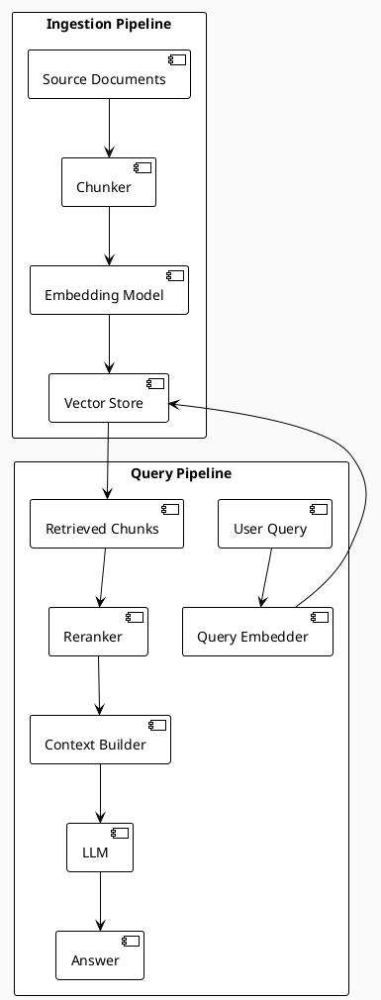

# RAG Patterns Skill

## When to Activate

- Building AI features over your own data (docs, knowledge base, customer data)
- Implementing semantic search
- Reducing LLM hallucinations by grounding answers in retrieved context
- Building chatbots, Q&A systems, or AI assistants
- Designing prompt templates and managing prompt versions

---

## RAG Architecture Overview



---

## Step 1: Chunking Strategy

The single biggest lever for RAG quality. Wrong chunking = poor retrieval.

```typescript
// Fixed-size chunking (simple, poor quality)
function fixedChunk(text: string, size = 512, overlap = 50): string[] {
  const chunks: string[] = [];
  for (let i = 0; i < text.length; i += size - overlap) {
    chunks.push(text.slice(i, i + size));
  }
  return chunks;
}

// Semantic chunking (recommended — split at natural boundaries)
import { RecursiveCharacterTextSplitter } from 'langchain/text_splitter';

const splitter = new RecursiveCharacterTextSplitter({
  chunkSize: 1000,
  chunkOverlap: 200,
  separators: ['\n\n', '\n', '. ', ' ', ''],  // Try boundaries in order
});

const chunks = await splitter.splitText(document);

// Document-aware chunking (best for structured docs)
// Markdown: split at headings
// Code: split at function/class boundaries
// PDFs: split at page + paragraph boundaries
// Preserve: always keep chunk + its section heading for context

// Metadata: always attach to chunks
interface Chunk {
  id: string;
  content: string;
  metadata: {
    documentId: string;
    source: string;           // URL or filename
    sectionTitle?: string;    // Nearest heading above this chunk
    pageNumber?: number;
    createdAt: string;
  };
  embedding?: number[];
}
```

### Chunking Rules

| Document type | Strategy | Chunk size |
|---------------|----------|------------|
| General prose | Recursive character + paragraph boundary | 800-1200 tokens |
| Markdown docs | Split at `##` headings | Full section |
| Code files | Split at function/class | Full function |
| Q&A pairs | Keep Q+A together, never split | Full pair |
| Tables | Keep entire table, add row context | Full table |

---

## Step 2: Embeddings

```typescript
// OpenAI embeddings (best quality for English)
import OpenAI from 'openai';

const openai = new OpenAI();

async function embed(text: string): Promise<number[]> {
  const response = await openai.embeddings.create({
    model: 'text-embedding-3-small',  // 1536 dims, fast + cheap
    // model: 'text-embedding-3-large', // 3072 dims, better quality
    input: text,
  });
  return response.data[0].embedding;
}

// Batch embeddings (always batch, never embed one-by-one in ingestion)
async function embedBatch(texts: string[]): Promise<number[][]> {
  const response = await openai.embeddings.create({
    model: 'text-embedding-3-small',
    input: texts,  // Up to 2048 inputs per request
  });
  return response.data.map(d => d.embedding);
}
```

---

## Step 3: Vector Store (pgvector — recommended for most stacks)

```sql
-- Enable pgvector extension
CREATE EXTENSION IF NOT EXISTS vector;

-- Store chunks with embeddings
CREATE TABLE document_chunks (
    id          UUID PRIMARY KEY DEFAULT gen_random_uuid(),
    document_id UUID NOT NULL REFERENCES documents(id) ON DELETE CASCADE,
    content     TEXT NOT NULL,
    metadata    JSONB NOT NULL DEFAULT '{}',
    embedding   VECTOR(1536),    -- match your model's dimensions
    created_at  TIMESTAMPTZ DEFAULT now()
);

-- IVFFlat index for approximate nearest neighbor search
-- lists = sqrt(number_of_rows) is a good starting point
CREATE INDEX ON document_chunks
    USING ivfflat (embedding vector_cosine_ops)
    WITH (lists = 100);

-- Alternatively: HNSW (better recall, higher build time)
-- CREATE INDEX ON document_chunks USING hnsw (embedding vector_cosine_ops);
```

```typescript
// Similarity search
async function search(
  query: string,
  limit = 5,
  threshold = 0.75
): Promise<Chunk[]> {
  const queryEmbedding = await embed(query);

  const results = await db.execute(sql`
    SELECT
      id,
      content,
      metadata,
      1 - (embedding <=> ${JSON.stringify(queryEmbedding)}::vector) AS similarity
    FROM document_chunks
    WHERE 1 - (embedding <=> ${JSON.stringify(queryEmbedding)}::vector) > ${threshold}
    ORDER BY embedding <=> ${JSON.stringify(queryEmbedding)}::vector
    LIMIT ${limit}
  `);

  return results.rows;
}
```

---

## Step 4: Hybrid Search (BM25 + Vector)

Vector search alone misses exact keyword matches. Combine both.

```sql
-- Enable full-text search
ALTER TABLE document_chunks ADD COLUMN tsv TSVECTOR
    GENERATED ALWAYS AS (to_tsvector('english', content)) STORED;
CREATE INDEX ON document_chunks USING GIN(tsv);

-- Hybrid search: RRF (Reciprocal Rank Fusion) to merge rankings
WITH vector_results AS (
    SELECT id, ROW_NUMBER() OVER (ORDER BY embedding <=> $1) AS rank
    FROM document_chunks
    ORDER BY embedding <=> $1
    LIMIT 20
),
fts_results AS (
    SELECT id, ROW_NUMBER() OVER (ORDER BY ts_rank(tsv, query) DESC) AS rank
    FROM document_chunks, plainto_tsquery('english', $2) query
    WHERE tsv @@ query
    LIMIT 20
)
SELECT
    d.id, d.content, d.metadata,
    COALESCE(1.0 / (60 + v.rank), 0) + COALESCE(1.0 / (60 + f.rank), 0) AS rrf_score
FROM document_chunks d
LEFT JOIN vector_results v ON d.id = v.id
LEFT JOIN fts_results f ON d.id = f.id
WHERE v.id IS NOT NULL OR f.id IS NOT NULL
ORDER BY rrf_score DESC
LIMIT 10;
```

---

## Step 5: Reranking

After retrieval, use a cross-encoder to re-score candidates. Dramatically improves precision.

```typescript
import Anthropic from '@anthropic-ai/sdk';

async function rerank(
  query: string,
  chunks: Chunk[],
  topK = 3
): Promise<Chunk[]> {
  const scores = await Promise.all(
    chunks.map(async (chunk) => {
      const response = await anthropic.messages.create({
        model: 'claude-haiku-4-5-20251001',  // cheap + fast for scoring
        max_tokens: 10,
        messages: [{
          role: 'user',
          content: `Rate relevance 0-10. Query: "${query}"\nText: "${chunk.content.slice(0, 500)}"\nScore:`,
        }],
      });
      const score = parseFloat(response.content[0].text) || 0;
      return { chunk, score };
    })
  );

  return scores
    .sort((a, b) => b.score - a.score)
    .slice(0, topK)
    .map(s => s.chunk);
}
```

---

## Step 6: Prompt Template

```typescript
function buildRAGPrompt(query: string, chunks: Chunk[]): string {
  const context = chunks
    .map((c, i) => `[${i + 1}] Source: ${c.metadata.source}\n${c.content}`)
    .join('\n\n---\n\n');

  return `You are a helpful assistant. Answer the question using ONLY the provided context.
If the answer is not in the context, say "I don't have information about that."
Always cite which source [1], [2], etc. supports your answer.

CONTEXT:
${context}

QUESTION: ${query}

ANSWER:`;
}

// Always set a reasonable max_tokens to control cost
const response = await anthropic.messages.create({
  model: 'claude-sonnet-4-6',
  max_tokens: 1024,
  messages: [{ role: 'user', content: buildRAGPrompt(query, topChunks) }],
});
```

---

## Semantic Caching (LLM cost reduction)

```typescript
// Cache LLM responses by semantic similarity of the query
// Identical or near-identical questions get cached response

async function cachedGenerate(query: string): Promise<string> {
  const queryEmbedding = await embed(query);

  // Check semantic cache (threshold ~0.95 = very similar queries)
  const cached = await db.execute(sql`
    SELECT response FROM llm_cache
    WHERE 1 - (embedding <=> ${JSON.stringify(queryEmbedding)}::vector) > 0.95
    AND created_at > NOW() - INTERVAL '24 hours'
    ORDER BY embedding <=> ${JSON.stringify(queryEmbedding)}::vector
    LIMIT 1
  `);

  if (cached.rows.length > 0) return cached.rows[0].response;

  // Cache miss — call LLM
  const response = await callLLM(query);

  // Store in cache
  await db.insert(llmCache).values({
    query,
    embedding: queryEmbedding,
    response,
  });

  return response;
}
```

---

## Evaluation

```typescript
// Evaluate RAG quality — measure retrieval AND generation
interface RAGEvalResult {
  query: string;
  retrievedChunks: Chunk[];
  answer: string;
  metrics: {
    contextPrecision: number;   // Are retrieved chunks relevant?
    contextRecall: number;      // Are all relevant chunks retrieved?
    answerRelevancy: number;    // Does answer address the question?
    faithfulness: number;       // Is answer grounded in context?
  };
}

// Use LLM-as-judge for each metric (0-1 scale)
// Recommended: RAGAS library for Python, or implement with claude-haiku-4-5
```

---

## Checklist

- [ ] Chunking strategy matches document structure (not fixed-size for prose)
- [ ] Section titles/headings prepended to chunks for context
- [ ] Embeddings batched during ingestion (not one-by-one)
- [ ] pgvector index type chosen (IVFFlat for >100k rows, exact for smaller)
- [ ] Hybrid search (BM25 + vector) for better recall
- [ ] Reranking step before passing to LLM
- [ ] Retrieved chunk count logged and monitored (too few = poor answers)
- [ ] Semantic cache for repeated similar queries
- [ ] RAG evaluation suite (context precision, faithfulness) in CI
- [ ] Max tokens set on all LLM calls to cap cost
- [ ] Source citations in responses so users can verify
