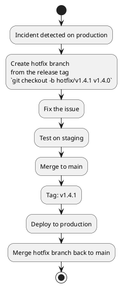

# Release Management Skill

A release is not just a deploy. It's a versioned, documented, communicable event that users and stakeholders can reason about.

## When to Activate

- Cutting a new release (`/release`)
- Deciding what version number to assign
- Generating a CHANGELOG from commit history
- Setting up automated release notes
- Planning a hotfix release
- Documenting rollback procedures

---

## Semantic Versioning (SemVer)

```
MAJOR.MINOR.PATCH  (e.g. 2.4.1)
```

| Increment | When | Example |
|-----------|------|---------|
| MAJOR | Breaking change (API incompatible) | `1.0.0` → `2.0.0` |
| MINOR | New feature, backwards compatible | `1.3.0` → `1.4.0` |
| PATCH | Bug fix, backwards compatible | `1.4.2` → `1.4.3` |

**Pre-releases:** `1.4.0-beta.1`, `2.0.0-rc.1`

**Rules:**
- Never release the same version twice
- Once a version is released, it is immutable — fix forward with a new version
- 0.x.y is for initial development — anything may change
- 1.0.0 signals a stable public API

---

## Conventional Commits → Version Bump

| Commit type | Version bump |
|-------------|-------------|
| `fix:` | PATCH |
| `feat:` | MINOR |
| `feat!:` or `BREAKING CHANGE:` footer | MAJOR |
| `chore:`, `docs:`, `test:`, `refactor:` | No bump |

```bash
# Examples
git commit -m "fix(auth): handle expired tokens correctly"    # PATCH
git commit -m "feat(api): add cursor-based pagination"        # MINOR
git commit -m "feat(auth)!: remove legacy password endpoint"  # MAJOR
```

---

## CHANGELOG Format

```markdown
# Changelog

All notable changes to this project will be documented here.
Format: [Keep a Changelog](https://keepachangelog.com/en/1.0.0/)

## [Unreleased]

## [1.4.0] — 2026-03-06

### Added
- Cursor-based pagination on all list endpoints (#234)
- GitHub OAuth2 login flow (#241)

### Changed
- Improved error messages for validation failures (#238)

### Fixed
- Session not invalidated on logout (#243)
- Race condition in order processing (#245)

### Security
- Rate limiting added to login endpoint (#239)

## [1.3.2] — 2026-02-20

### Fixed
- Incorrect timestamp format in API responses (#231)
```

---

## Release Checklist

Before tagging a release:

```markdown
## Pre-Release Checklist

- [ ] All tests pass on main (`git checkout main && npm test`)
- [ ] No critical issues open for this milestone
- [ ] CHANGELOG updated (unreleased → version + date)
- [ ] Version bumped in package.json / pyproject.toml / go.mod / pom.xml
- [ ] Migrations tested against a production-sized dataset (if DB changes)
- [ ] Breaking changes documented with migration guide
- [ ] API deprecations communicated (Sunset header added if applicable)

## Deploy to Staging First
- [ ] Deployed to staging
- [ ] Smoke tests passing on staging (`/health/ready`)
- [ ] Manual QA of changed flows (if user-facing)

## Tag and Release
- [ ] Git tag created: `git tag -a v1.4.0 -m "Release v1.4.0"`
- [ ] Tag pushed: `git push origin v1.4.0`
- [ ] GitHub Release created with release notes
- [ ] Team notified (Slack, email)
```

---

## Rollback Procedure

Document this per project. General approach:

```bash
# Option 1: Revert deployment (preferred — no data changes)
fly deploy --image ghcr.io/myorg/myapp:v1.3.2
# or
kubectl set image deployment/myapp app=ghcr.io/myorg/myapp:v1.3.2

# Option 2: Revert git (if code is the issue)
git revert HEAD~1 --no-edit
git push origin main
# Let CI/CD redeploy

# Option 3: Feature flag (if flag exists for the broken feature)
# Toggle feature off via LaunchDarkly / Unleash — no deploy needed

# Database migrations: NEVER rollback. Fix forward with a new migration.
```

**Rollback decision tree:**
1. Is the issue a DB migration? → Fix forward (write a corrective migration)
2. Is the issue code-only? → Revert deployment to previous image
3. Is the issue a new feature? → Feature flag off (if available) or revert deployment
4. Is it a security issue? → Immediate revert + incident response

---

## Hotfix Process



---

## Automating Releases

With `release-please` (Google):
```yaml
# .github/workflows/release.yml
name: Release Please
on:
  push:
    branches: [main]
jobs:
  release:
    runs-on: ubuntu-latest
    steps:
      - uses: googleapis/release-please-action@v4
        with:
          release-type: node  # or: python, go, java, simple
```

`release-please` automatically:
1. Opens a "Release PR" with updated CHANGELOG and bumped version
2. When merged, creates the git tag and GitHub Release
