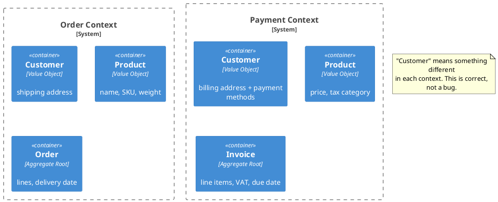
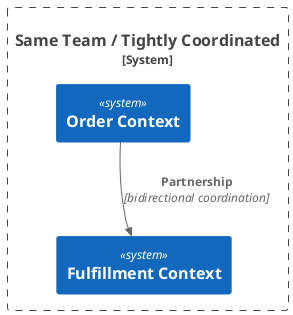
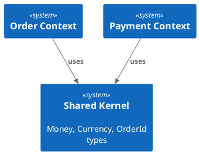
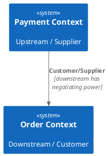
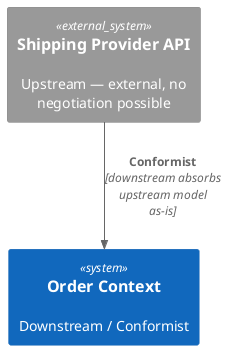
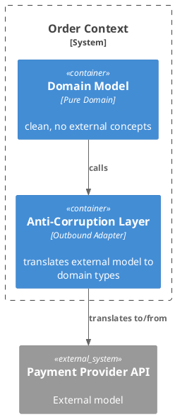
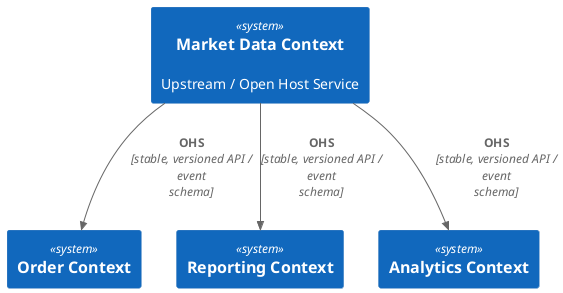
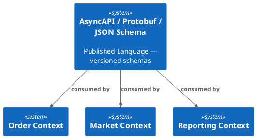
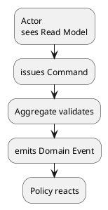
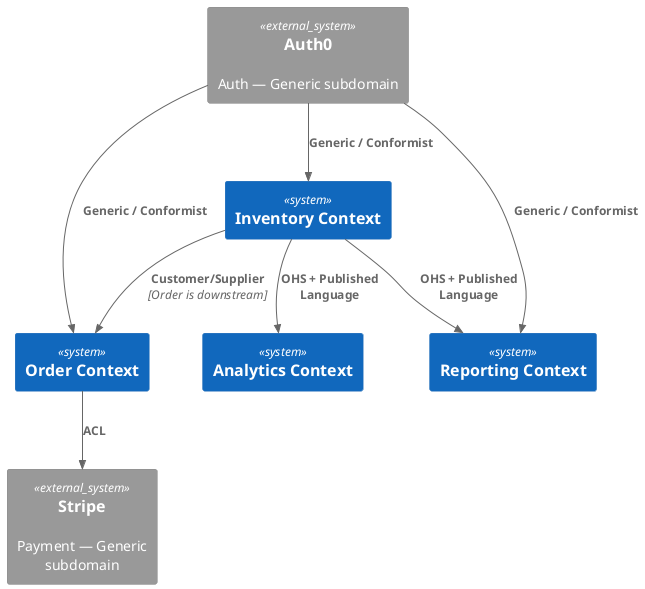

# Strategic DDD

Strategic DDD answers **what** to build and **where** to invest — before tactical DDD answers **how** to model it.

## When to Activate

- Decomposing a monolith into services
- Deciding which bounded contexts need rich domain models (DDD) vs. simple CRUD
- Designing how two services communicate (sync vs. async, ACL vs. conformist)
- Planning a new product area: should we build this or buy it?
- Running Event Storming to discover domain boundaries
- Naming teams and code ownership boundaries

---

## Step-by-Step Discovery Process

Use this sequence when starting strategic DDD on a codebase or new product area:

### 1. Run Event Storming (2–4 hours with domain experts)

- List domain events on sticky notes (past tense): "Order Placed", "Payment Received", "Inventory Updated"
- Group events by time — events that always happen together suggest the same subdomain
- Mark **hot spots** (red sticky) where experts disagree or the process is unclear
- Commands trigger events: "Place Order" → "Order Placed" → "Inventory Reserved"

Output: timeline of events grouped into rough subdomain clusters.

### 2. Classify Subdomains (Step 1 below)

For each cluster: Core / Supporting / Generic? If you can't agree, it's probably Supporting.

### 3. Draw Bounded Contexts

One context = one consistent ubiquitous language. Ask for each cluster:
- Do domain experts in different departments use the same word differently? If yes → separate contexts.
- Does this cluster change at a different rate than its neighbors? If yes → separate contexts.
- Could this be replaced by a SaaS product? If yes → it's Generic, wrap it.

Output: Bounded Context diagram with explicit names and owners.

### 4. Map Relationships (Step 3 below)

For every pair of contexts that communicate:
- Who is upstream (supplier)? Who is downstream (consumer)?
- Is the relationship Partnership / Customer-Supplier / Conformist / ACL / Open Host / Published Language / Separate Ways?

### 5. Decide Service Topology

| If... | Then... |
|-------|---------|
| New product, small team | Monolith with Bounded Context packages |
| Team > 8 engineers or independent deploy needed | Extract Core Domains to own services |
| Core Domain changes daily | Own service + own DB (no shared DB) |
| Supporting Domain, low change rate | Stay in monolith, own package |

**Stop here before coding.** The diagram is the deliverable, not the code.

---

## Step 1: Subdomain Classification

Not all parts of the system deserve the same investment. Classify every subdomain before modeling it.

### Core Domain

The **competitive advantage** — what makes your product different from competitors. Customers pay for this.

- **Invest fully**: Rich domain model, DDD tactical patterns, best engineers
- **Never buy**: A generic implementation would eliminate your advantage
- **Changes often**: Driven by business strategy, not technology

```
Prediction Market Platform:
  Core → Market creation rules, resolution logic, payout calculation
  Core → Risk engine, position limits, liquidity model
```

### Supporting Subdomain

Necessary for the business to function, but not differentiating. Competitors have similar needs.

- **Build yourself**: No off-the-shelf solution fits, but simpler implementation is OK
- **CRUD acceptable**: Active Record, simple service layer — no need for full DDD
- **Can be outsourced later**: If a SaaS solution appears, replace it

```
Prediction Market Platform:
  Supporting → User profiles, KYC workflow, notification preferences
  Supporting → Reporting dashboard, admin tools, market moderation
```

### Generic Subdomain

A solved problem. Every company needs it; no company differentiates on it.

- **Buy or use open source**: Auth0, Stripe, SendGrid, AWS S3
- **Never build from scratch**: You will do it worse and slower than specialists
- **Wrap with Anti-Corruption Layer**: Don't let the vendor's model leak into your domain

```
Prediction Market Platform:
  Generic → Authentication & authorization (Auth0, Keycloak)
  Generic → Payment processing (Stripe, Adyen)
  Generic → Email delivery (SendGrid, SES)
  Generic → File storage (S3, GCS)
```

### Classification Table

| Question | Core | Supporting | Generic |
|---|---|---|---|
| Unique competitive advantage? | Yes | No | No |
| Would a competitor's copy hurt us? | Severely | Slightly | Not at all |
| Off-the-shelf solution exists? | No | Rarely | Yes |
| DDD investment justified? | Always | Sometimes | Never |
| Team ownership | Senior, stable | Any | Ops/integrations |

---

## Step 2: Bounded Context Design

A **Bounded Context** is an explicit boundary within which a domain model is defined and applicable. The same word can mean different things in different contexts — that is expected and correct.



### One Context = One Ubiquitous Language

Within a Bounded Context:
- Exact, unambiguous terms agreed upon with domain experts
- Same terms in code, tests, conversations, documentation
- No translation: if domain expert says "publish", code says `publish()` — not `activate()` or `setStatusToActive()`

Outside a Bounded Context:
- Translation is expected and handled by Context Map patterns (see below)

### Bounded Context ≠ Microservice (necessarily)

| Situation | Recommendation |
|---|---|
| Starting a new product | Monolith with clear module boundaries = Bounded Contexts as packages |
| Growing team, independent deployments needed | Extract contexts to separate services |
| Core Domain under heavy development | Own service — isolated deployment, own DB |
| Supporting Domain, low change rate | Can stay in monolith or share service with similar contexts |

**Don't extract too early.** A well-structured monolith with clear Bounded Context boundaries is easier to split later than a poorly designed microservice mesh.

---

## Step 3: Context Map — Relationship Patterns

A **Context Map** documents how Bounded Contexts relate to each other. There are 7 canonical patterns:

### 1. Partnership

Both contexts evolve together; teams coordinate closely. Changes in one require coordination with the other.



**When**: Two contexts under the same team, or teams with high mutual trust and aligned roadmaps.
**Risk**: Creates coupling — if teams diverge, migrate to Customer/Supplier.

---

### 2. Shared Kernel

Two contexts share a subset of the domain model (code). Both teams must agree before changing the shared part.



**When**: Small, stable shared concepts (value objects, typed IDs) that would diverge badly if duplicated.
**Risk**: Coordination overhead. Keep the kernel as small as possible.
**Anti-pattern**: Sharing JPA entities or ORM models — share domain types only.

---

### 3. Customer / Supplier

Upstream produces, downstream consumes. Downstream has influence over upstream's roadmap (it's a customer).



**When**: One context depends on another, but the consumer has negotiating power.
**Downstream gets**: A say in what the upstream exposes, SLAs, planned changes communicated early.

---

### 4. Conformist

Upstream has no incentive to accommodate downstream. Downstream accepts the upstream model as-is — no translation.



**When**: Integrating with a dominant external system (legacy ERP, government API) where you have zero influence.
**Cost**: Downstream's model is polluted by upstream's concepts. Accept this consciously.
**Alternative**: Add an ACL if pollution is too painful.

---

### 5. Anti-Corruption Layer (ACL)

Downstream translates between upstream's model and its own domain model. Upstream's concepts never appear in downstream's domain.



**When**:
- Integrating with a legacy system or external API whose model is hostile/incompatible
- The generic subdomain must not pollute the core domain
- Conformist would cause unacceptable coupling

**Implementation**: The ACL is an outbound adapter. It maps external DTOs/responses to your domain types.

```
// ACL in adapter/out/client/ — translates external model to domain model
class StripePaymentAdapter implements PaymentPort {
    initiatePayment(order: Order, amount: Money): Promise<PaymentResult> {
        // Translate: domain Order → Stripe PaymentIntent request
        // Call Stripe API
        // Translate: Stripe response → domain PaymentResult
    }
}
```

---

### 6. Open Host Service (OHS)

Upstream publishes a well-documented, stable service protocol that multiple downstreams consume. Upstream invests in the protocol, not in custom integrations per consumer.



**When**: One context serves many consumers. The upstream defines the protocol once; consumers conform to it.
**Combined with Published Language**: The protocol is expressed in a shared, explicit format.

---

### 7. Published Language

A well-documented, shared information exchange model (schema) that multiple contexts use. Not tied to one context's internal model.



**When**: Event-driven systems where producer and consumer should be fully decoupled.
**Examples**: Protobuf, AsyncAPI, Avro schemas, CloudEvents format.
**Combined with OHS**: OHS defines the service, Published Language defines the data format.

---

### Context Map Quick Reference

| Pattern | Relationship | Translation needed? | Coupling |
|---|---|---|---|
| Partnership | Collaborative, symmetric | No | High |
| Shared Kernel | Shared code subset | No | Medium |
| Customer/Supplier | Upstream/downstream, negotiated | Optional | Medium |
| Conformist | Upstream dominant, no negotiation | No (absorbs upstream model) | Medium |
| Anti-Corruption Layer | Upstream hostile/incompatible | Yes (full translation) | Low |
| Open Host Service | Upstream publishes stable protocol | Protocol layer | Low |
| Published Language | Shared schema/format | Via schema | Very low |

---

## Step 4: Event Storming

Event Storming is a workshop technique for discovering domain boundaries collaboratively with domain experts.

### Big Picture Event Storming (3–4 hours)

Goal: Discover all domain events in the system. Identify hotspots and Bounded Contexts.

**Materials**: Unlimited wall space, sticky notes in 5 colors:
- 🟠 **Orange**: Domain Events (past tense — "Market Published", "Order Placed")
- 🔴 **Red dot**: Hotspot / open question / problem area
- 🟡 **Yellow**: Actor (who triggered the event?)
- 🔵 **Blue**: Command (what caused the event? "Publish Market")
- 🟣 **Purple**: Policy / reaction ("When X happens, then Y")

**Process**:
1. Everyone writes Domain Events on orange stickies — no discussion, just dump
2. Place on wall in rough chronological order (left = earlier)
3. Add red dots where questions arise or the flow is unclear
4. Group related events — these clusters become Bounded Context candidates
5. Name each cluster with the domain expert's language

**Output**: A visual map of the entire domain + identified boundaries

---

### Process-Level Event Storming (2–3 hours)

Goal: Design the flow within one Bounded Context in detail.

Add to the board:
- 🔵 **Blue**: Commands (user intent — "Publish Market")
- 🟡 **Yellow**: Actors (User, System, Timer)
- 🟤 **Brown**: Aggregate (which aggregate handles the command?)
- 🟢 **Green**: Read Model / View (what data does the actor see before commanding?)

**Result**: A precise flow:



---

### Design-Level Event Storming (2–3 hours)

Goal: Define the actual aggregate boundaries and domain model for implementation.

For each aggregate identified:
- What commands does it handle?
- What invariants does it protect?
- What events does it emit?
- What other aggregates does it reference (by ID only)?

**Output**: Aggregate definitions ready for tactical DDD implementation.

---

## Putting It Together: Decision Sequence

```
1. Identify subdomains
   └─ Core / Supporting / Generic?

2. For Core subdomains:
   └─ Run Event Storming to discover boundaries
   └─ Define Bounded Contexts + Ubiquitous Language
   └─ Apply tactical DDD (Aggregates, Value Objects, Domain Events)

3. For Supporting subdomains:
   └─ Simple service with Active Record or CRUD is fine
   └─ No need for full DDD

4. For Generic subdomains:
   └─ Buy SaaS / use open source
   └─ Wrap with Anti-Corruption Layer

5. Map relationships between contexts:
   └─ Choose Context Map pattern for each pair
   └─ Document in a Context Map diagram
```

---

## Context Map Diagram Format



---

## Anti-Patterns

### Big Ball of Mud
No explicit Bounded Contexts. Everything imports everything. The "context" is the entire system. Every new feature requires understanding the whole codebase.

**Fix**: Identify natural clusters of domain events (Event Storming), draw boundaries, enforce them with package/module structure or service boundaries.

### Anemic Context Map
Contexts exist on paper but communicate via shared databases, direct ORM queries across service boundaries, or God Objects referenced everywhere.

**Fix**: Each Bounded Context owns its data. Communication only via APIs or events. Never shared tables.

### Core Domain as Generic
Treating the core competitive advantage as a commodity to be bought or outsourced.

**Example**: A fintech building a risk engine using a generic third-party scoring service — the scoring IS the product.

### Over-Engineering Supporting Domains
Applying full DDD tactical patterns (Aggregates, Domain Events, Event Sourcing) to a simple CRUD admin panel.

**Fix**: Match investment to subdomain type. Supporting domains can use Active Record, thin service layers, simple CRUD.

---

## Checklist: Starting a New System

- [ ] Classify all subdomains (Core / Supporting / Generic)
- [ ] Identified which Generic subdomains to buy vs. build
- [ ] Run Big Picture Event Storming for Core subdomains
- [ ] Named each Bounded Context with domain expert terms
- [ ] Defined Ubiquitous Language glossary per context
- [ ] Drawn Context Map with relationship patterns
- [ ] Decided: monolith with modules, or separate services?
- [ ] Core subdomains have separate codebases / packages with enforced boundaries
- [ ] Generic subdomains wrapped with ACL (not leaking vendor model into domain)

## Reference

- Tactical DDD patterns: see skills `ddd-java` (Java) and `ddd-typescript` (TypeScript)
- Hexagonal Architecture: see skills `hexagonal-java`, `hexagonal-typescript`
- Event-driven integration: see skill `springboot-patterns` (Spring Events / Kafka section)
